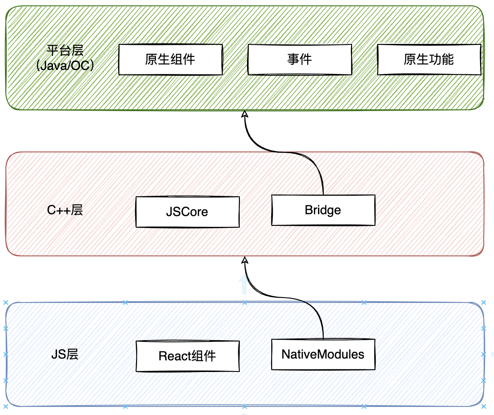
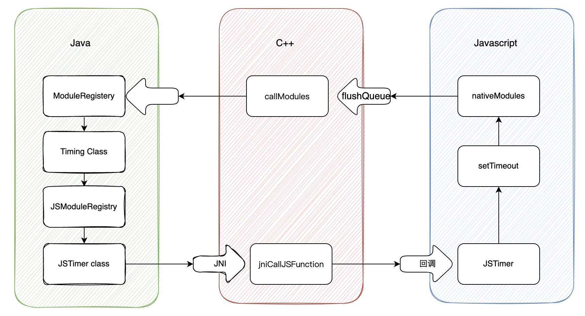
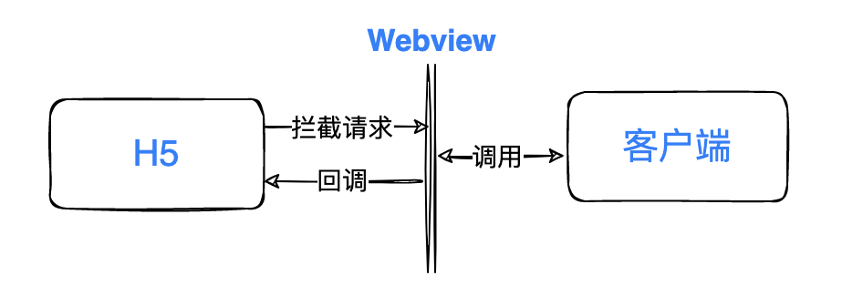

# RN组件

RN的JS组件最后都会渲染成原生组件。在使用H5时，Webview是JS的执行引擎，同时Webview还是页面的渲染引擎。

# RN组成



1.  平台层负责原生组件的渲染和提供各式各样的原生能力，由原生语言实现
2.  桥接层负责解析JS代码，JS和Java/OC代码互调，由C++实现
3.  JS层负责跨端页面具体的业务逻辑

## 桥接层

### JSCore

- `JSContextGetGlobalObject`：获取JavaScript运行环境的Global对
- `JSObjectSetProperty/JSObjectGetProperty`：JavaScript对象的属性操作：set和get。
- `JSEvaluateScript`：在JavaScript环境中执行一段JS脚本。
- `JSObjectCallAsFunction`：在JavaScript环境中调用一个JavaScript函数

## 通信(消息队列)

- JS环境会维护一份所有Native模块的`moduleID`和`methodID`映射 `NativeModules`,用来调用Native模块时查找对应的ID。
- Java环境也会维护一份JavaScript模块的映射`JSModuleRegistry`,用来调用JS代码。

实际代码中，Native模块和JS模块的通信需要通过中间层也就是C++层的过渡，也就是说Native模块和JS模块实际上只是在和C++模块进行通信。

### C++和JS通信

JSCore让C++拿到运行环境的global对象并能操作它的属性，JS代码会在global对象中注入一些原生模块需要的API，**这是JS向C++提供操作API的主要方式**

- RN中JS会在global对象中设置`__fbBatchedBridge`变量，并在变量塞入了4个API，做为JS被调用的入口，主要API包括：

```jsx
callFunctionReturnFlushedQueue // 让 C++ 调用 JS 模块
invokeCallbackAndReturnFlushedQueue // 让 C++ 调用 JS 回调
flushedQueue // 清空 JS 任务队列
callFunctionReturnResultAndFlushedQueue // 让 C++ 调用 JS 模块并返回结果
```

- JS还在global中设置了__fbGenNativeModule，用来给C++调用后在JS环境生成Java模块的映射对象，也就是NativeModules模块。数据结构类似

```jsx
{
    "Timing": {
        "moduleID": "1001",
        "method": {
            "createTimer": {
                "methodID": "10001"
            }
        }
    }
}
```

- 通过NativeModules的映射，开发者能拿到调用的模块[moduleID]和方法[methodID]

C++通过JSCore的`JSObjectSetProperty`方法在global对象中塞入了几个Native API，让JS能通过它们来调用C++模块，API：

```jsx
nativeFlushQueueImmediate // 立即清空 JS 任务队列
nativeCallSyncHook // 同步调用 Native 方法
nativeRequire  // 加载 Native 模块
```

### 平台(Java)和C++通信

Java和C++的互相调用通过`JNI`(Java Native Interface),通过JNI，C++层会暴露一些API给Java层调用，来让Java跟JS层通信。通过JNI暴露给Java的方法:

```jsx
initializeBridge // 初始化：C++ 从 Java 拿到 Native 模块，作为参数传给 JS 生成 NativeModules
jniLoadScriptFromFile // 加载 JS 文件
jniCallJSFunction // 调用 JS 模块
jniCallJSCallback// 调用 JS 回调
setGlobalVariable // 编辑 global 变量
getJavaScriptContext // 获取 JS 运行环境
```

### 一次RN内Java和JS通信流程



- setTimeout在JSTimer.js被调用，通过NativeModules找到Timing Calss的ModuleID和MethodID，放到任务队列MessageQueue中
- Native通过事件或者主动触发MessageQueue队列，C++层把moduleID，methodID和参数交给ModuleRegistry，由它找到Native模块的代码，Timing类；
- Timing调用`createTimer`方法，调用系统计时功能实现延迟调用。
- 记时结束，Timing类需要回调JS函数

```jsx
// timerToCall 是回调函数的 ID 数组
getReactApplicationContext()
    .getJSModule(JSTimers.class)
    .callTimers(timerToCall);
```

- getJSModule通过JSModuleRegistry找到需要调用的JS模块，并调用相关方法，调用HSTimers模块的callTimers方法
- Java通过JNI接口`jniCallJSFunction`通过C++调用JS模块，并传入module:`JSTimer`和method:`callTimers`
- C++调用JS暴露出来的`callFunctionReturnFlushedQueue`带上module和 method回到JS环境
- JS执行`callFunctionReturnFlushedQueue`方法找到RN初始化阶段注册好的JSTimer模块的`callTimers`函数,进行调用。

## RN的 JSBrige

👆通过`SetTimeout`进行了一次通信。

业务中的Brige需要包含一些额外的场景，比如并发调用，事件监听等。

- 并发调用

```
web同时发送多个请求，为了将请求结果回调到正确的回调函数内，需要保存请求到回调函数的映射，Brige中的调用也一样。
```

- 事件监听

```jsx
JS代码监听页面是否切换到后台，同一个回调在页面多次切换到后台时要被调用多次。但是RN的JSCallback只允许调用一次(每个callback会携带是否被调用过的标记)，回调不适合这种场景。

`实现订阅分发模块`：RCTDeviceEventEmitter 
Native模块通过getJSModule拿到`RCTDeviceEventEmitter`,可以在Native端发出JS事件并带上回调参数和映射ID，不走JSCallback。

```


# H5跨端通信



H5中的跨端通信成为`JSBrige`，在进行一次JSBrige调用时会携带4个参数:

```jsx
ModuleId:模块ID     // 定位调用的原生方法
MethodId:方法ID     // 定位调用的原生方法
params:参数         // 原生方法所需参数
CallBackId:JS回调名 // JS回调函数
```

## 拦截请求

### 安卓

`WebChromeClient.onJsPrompt`

## 执行回调

### 安卓

`evaluateJavascript`


## 客户端调用JS函数


## 通信方式

### JavascriptCore

```tsx
JSCore是IOS平台自带的JavaScript引擎，它允许在IOS应用中嵌入JavaScript代码并与其进行交互。通过JSCore，RN可以调用原生代码并接收其返回结果。
```

### Brige

```
Brige充当了JavaScript和原生平台之间的桥梁,允许数据在两者之间传递。提供了一种方式来调用原生组件和传递数据。
```

## 通信过程

# 问题


##### **1.**panResponder内部嵌套ScrollView

ScrollView组件受*onMoveShouldSetPanResponder*/onStartShouldSetPanResponder事件影响

当ScrollView上级有 *onMoveShouldSetPanResponder:()=>true* | onStartShouldSetPanResponder:()=>true时 ScrollView无法连续滚动，在第二次手势滑动正在的滚动的组件时，组件会停下，重新滚动。

目的效果：第二次手势滑动时，组件继续滚动。

**FlatList组件**

```tsx
在view中添加 
<FlatList
    data={Messages}
    renderItem={({item}) => <View style={Style['messageCard']} 
                                    onResponderTerminationRequest={() => false}
                                    onStartShouldSetResponder={() => true}
                             >
                                    <PersonalEvent ></PersonalEvent>
                            </View>}
	keyExtractor={item => item.id}
/>
```

###### 原因

```
在滚动后，释放手指，再次触摸时，如果上级panResponder的 onMoveShouldSetPanResponder是true，会触发上级的 panResponder的 onPanResponderMove导致滚动停止，触发上级手势
```

###### 解决

```tsx
为有手势响应的组件设置开关，当在scrollView滚动时关闭上级手势系统，滚动结束后开启手势系统。
```

