# React18

构建 **快速响应** 的大型web应用程序

难点：

1. 遇到大计算量的操作或者设备性能不足使页面掉帧，导致卡顿。**CPU瓶颈**
2. 发送网络请求后，由于需要等待数据返回才能进一步操作导致不能快速响应。 **IO瓶颈**

## React事件系统

***不同的浏览器，事件存在不同的兼容性，react试图实现一个兼容所有浏览器的框架***

使用合成事件代替原生事件。

- 原生事件：addEventListener绑定的事件
- 合成事件：通过JSX绑定的事件。例：onClick={()=>handle()}

使用事件委托机制,不将事件绑定到DOM，而是在 root添加事件监听，统一处理。

当触发事件时，拿到target节点，收集触发节点->root节点上的捕获事件和冒泡事件，按顺序触发。

- 对于click,keydown...事件。对**冒泡和捕获进行事件绑定**
- 对于scroll,load,play等不冒泡的事件。对**捕获阶段进行绑定**

## Schedule（调度器）🚦

### Lane优先级

31位二进制表示优先级

### React事件优先级

```jsx
// 离散事件优先级，例如：点击事件，input输入等触发的更新任务，优先级最高
export const DiscreteEventPriority: EventPriority = SyncLane;
// 连续事件优先级，例如：滚动事件，拖动事件等，连续触发的事件
export const ContinuousEventPriority: EventPriority = InputContinuousLane;
// 默认事件优先级，例如：setTimeout触发的更新任务
export const DefaultEventPriority: EventPriority = DefaultLane;
// 闲置事件优先级，优先级最低
export const IdleEventPriority: EventPriority = IdleLane;
```

### Schedule优先级

```jsx
export const NoPriority = 0; // 没有任何优先级
export const ImmediatePriority = 1; // 立即执行的优先级，级别最高
export const UserBlockingPriority = 2; // 用户阻塞级别的优先级
export const NormalPriority = 3; // 正常的优先级
export const LowPriority = 4; // 较低的优先级
export const IdlePriority = 5; // 优先级最低，表示任务可以闲置
```

### Schedule的任务过期时间

不同的优先级对应着不同的任务过期时间。

```jsx
var IMMEDIATE_PRIORITY_TIMEOUT = -1;
var USER_BLOCKING_PRIORITY_TIMEOUT = 250;
var NORMAL_PRIORITY_TIMEOUT = 5000;
var LOW_PRIORITY_TIMEOUT = 10000;
// Never times out
var IDLE_PRIORITY_TIMEOUT = maxSigned31BitInt;
```

### Schedule计算过期时间 

scheduleCallback函数

```jsx
var timeout;
switch (priorityLevel) {
case ImmediatePriority:
  timeout = IMMEDIATE_PRIORITY_TIMEOUT;
  break;
case UserBlockingPriority:
  timeout = USER_BLOCKING_PRIORITY_TIMEOUT;
  break;
case IdlePriority:
  timeout = IDLE_PRIORITY_TIMEOUT;
  break;
case LowPriority:
  timeout = LOW_PRIORITY_TIMEOUT;
  break;
case NormalPriority:
default:
  timeout = NORMAL_PRIORITY_TIMEOUT;
  break;
}
// startTime可暂且认为是当前时间
var expirationTime = startTime + timeout;
```

### Schedule 中的 task

```jsx
var newTask = {
	id: taskIdCounter++,
    callback,       // 任务函数
	priorityLevel,  // 任务优先级
    startTime,      // 任务开始时间
    expirationTime, // 任务过期时间
    sortIndex：-1   // 小顶堆中的排序依据
}
```

### Schedule的功能

1. 多个任务的管理        【 任务优先级】
2. 单个任务的时间控制【时间片】

任务优先级让任务按照自身的紧急程度排序，让高优先级的任务最先被执行。

时间片规定单个任务在这一帧内最大的执行时间，任务一旦执行时间超过时间片，则会被打断，有节制的执行任务，这样可以保证页面不会因为任务连续执行的时间长产生卡顿。

衍生两大功能：***任务队列管理***、 ***时间片下任务的中断和恢复***。

### 任务队列管理

将任务分为两种：

- `未过期任务`：timeQueue
- `已过期任务`：taskQueue

#### 如何区分任务是否过期？

任务的开始时间(startTime)和当前时间(currentTime)比较。

startTime > currentTime：未过期，放入timeQueue;

startTime < current：过期，放入taskQueue;

#### 不同队列中任务如何排序？

- taskQueue：根据过期时间(expiration)排序,过期时间越早，越紧急，优先级越高。
- timeQueue：根据任务开始时间(startTime)排序，开始时间越早，任务执行优先级越高。

taskQueue是小顶堆。新任务入栈时，重新排列。

### 单个任务的中断以及恢复🚧

#### 判断单个任务的完成状态

如果任务函数返回值是函数，就说明当前任务未完成，需要继续调用任务函数，否则就是完成。

```jsx
从taskQueue中获取task，执行callback，如果返回的是一个函数fn就将fn赋值给callback,以待后续执行。
如果返回的不是函数，就证明task执行完毕，将task从taskQueue中推出。
```

#### 取消调度

```
将当前callback设为null。workLoop认为当前task已经执行完成，就会移出taskQueue。
```

### MessageChannel

生成浏览器中的一个宏任务，将资源交给浏览器更新页面,浏览器更新页面后再执行Schedule中的任务

#### 为什么使用MessageChannel

1. 不用微任务是因为微任务将在页面更新完成前全部执行，无法将资源释放给浏览器
2. 不用setTimeout是因为setTimeout创建的任务会至少延迟4ms，而MessageChannel总会在setTimeout之前执行，且执行消耗的时间小于setTimeout。
3. 不同requesIdelCallback是因为有兼容性，且在切换tab时,执行频率降低。
4. 不用requestAnimationFrame 是因为，当前页面未激活会停止执行

### React是如何使用Schedule的

***React将任务和任务的优先级交给Schedule管理，由Schedule承担起任务的调度。***

例如：

1. fiber树的构建
2. setState 状态的更新

React将我们产生的更新以及要进行的渲染任务做了优先级区分，让调度系统Schedule根据优先级进行任务的调度。

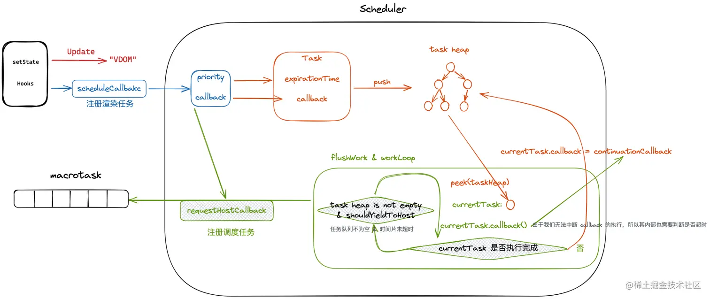


## Fiber树的构建

performConcurrentWorkOnRoot

```

```


## React 的生命周期

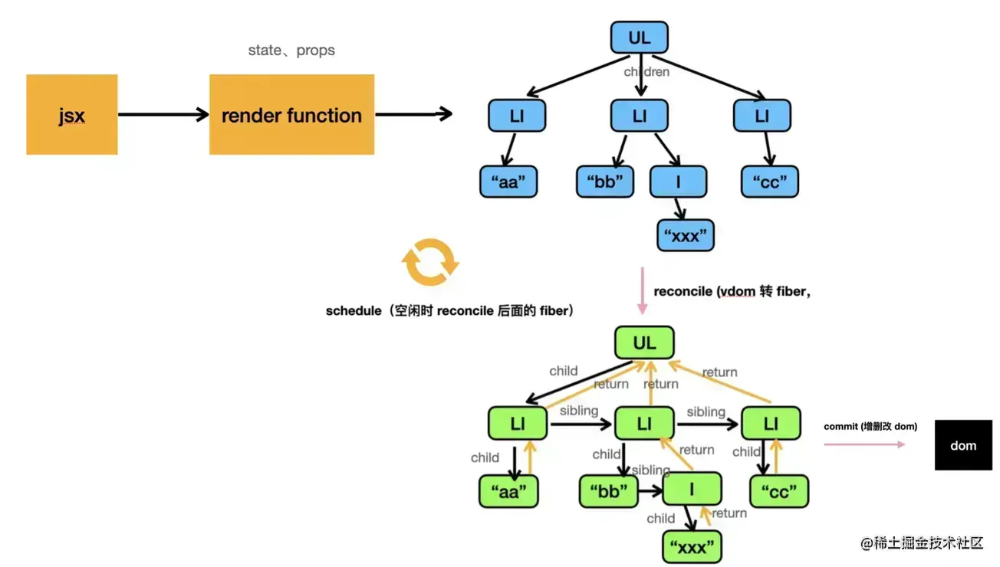


### react渲染阶段

##### render阶段

reconcile时将vdom转换为fiber。

##### commit阶段

具体操作dom，以及执行副作用函数的过程。分为3个阶段：

1. **before mutation**
2. **mutation**  //操作dom
3. **layout**   // ref的更新, useLayoutEffect 的执行

## hooks

react在不同阶段引用的hooks不是同一个函数。mount */update *

```jsx
const App = ()=>{
    const [num,setNum] = useState(111);
    const ref = useRef(1);
    useEffect(()=>{
        setTimeout(()=>{
            setNum(333);
		}, 2000)
    },[]);
    return <div>
    	{num}{ref.current}
    </div>
}
```

### mount阶段🌞

第一次调用use*时，创建**memoizedState** ，存储在**fiber.memoizedState**,后面的hook挂在上一个节点的next上。

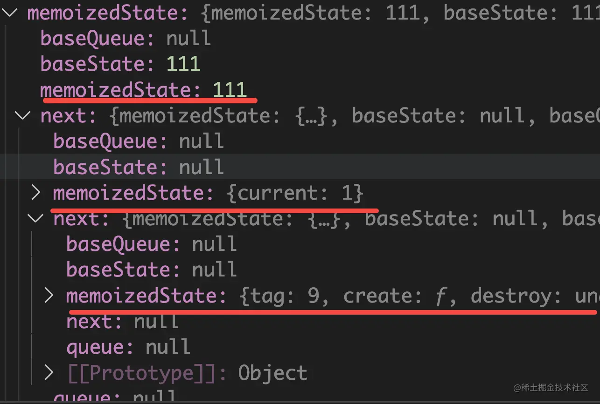

#### useRef

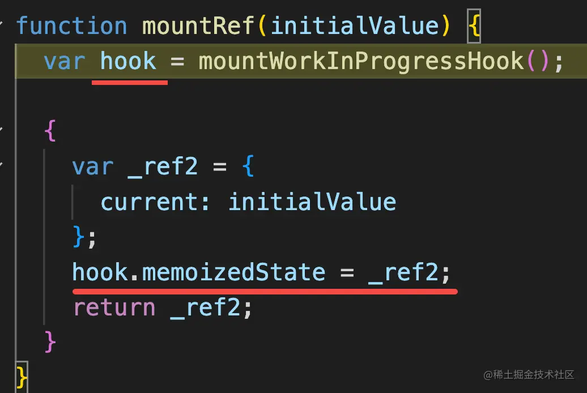

```
在mount时，将存储到memoizedState
```

#### useMemo


```jsx
在mount阶段缓存，memoizedState 缓存`返回值 `和  `依赖数组`
```

#### useCallback

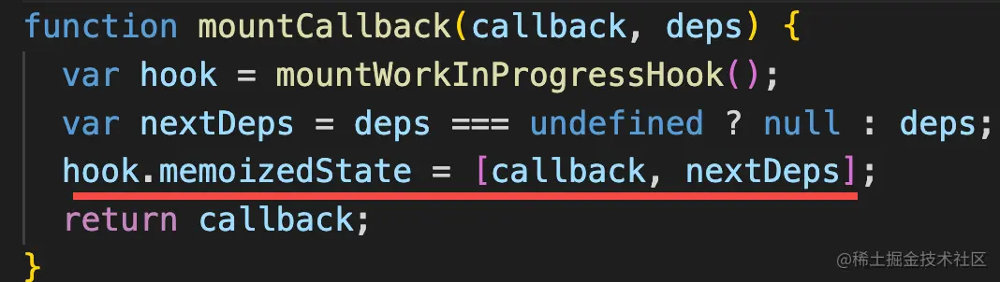

### update阶段 🌙

#### useRef

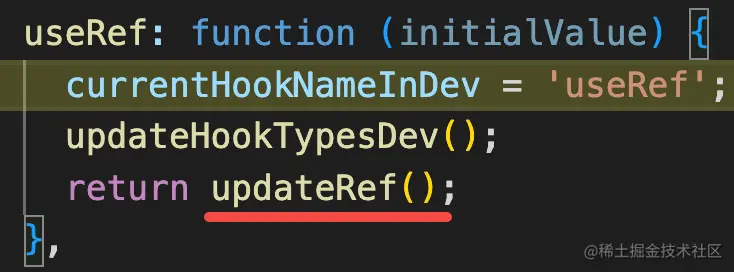

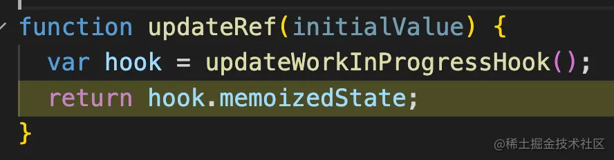

```jsx
取出hook.memoizedState。
`返回的ref对象始终是最开始的那个`
```

#### useMemo


```jsx
在update阶段,判断依赖项有没有更改。
1.没有更改就返回旧值，
2.有更改就运行函数,更新hook.memoizedState
```

#### useCallback

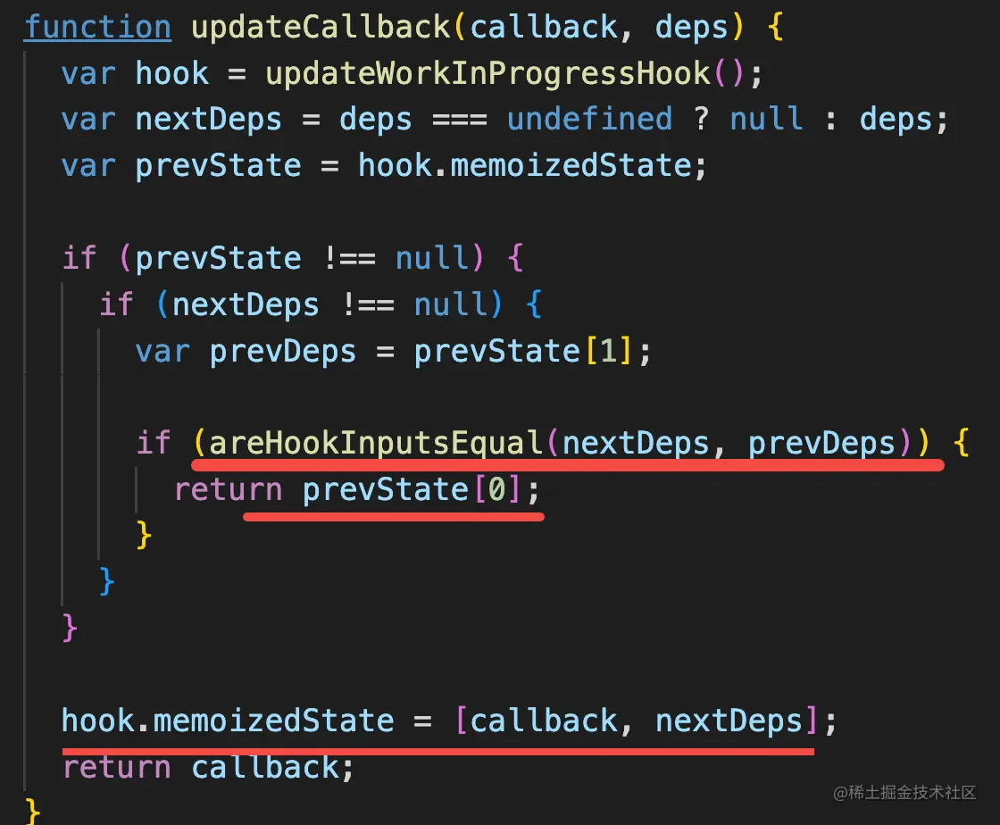

```
updateCallback和useMemo类似，也会判断依赖项。
```

## useEffect

两个函数对应 两个阶段

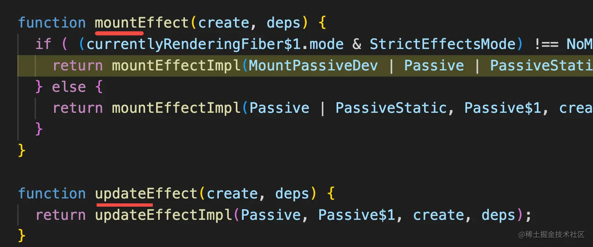

### mount阶段🌞

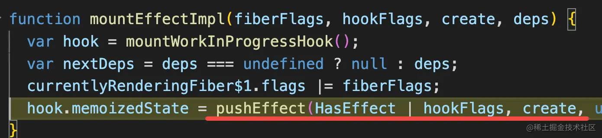

### update阶段 🌙

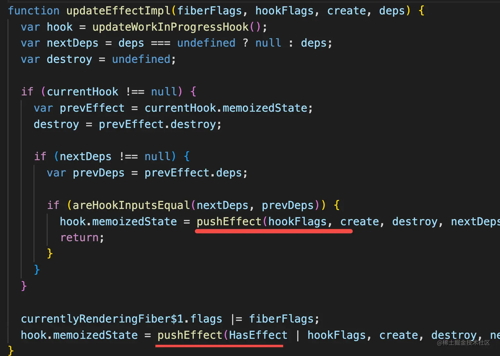

### pushEffect⭐

mount/create阶段都是运行 pushEffect。

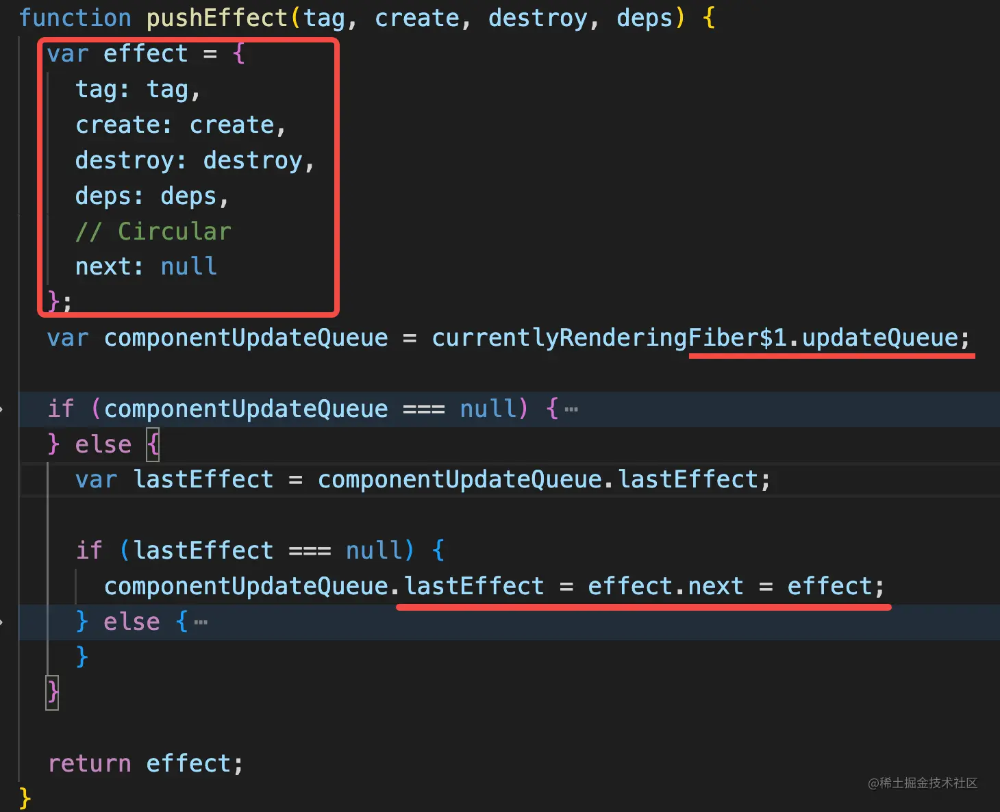

```jsx
创建了effect，并将它放到了`fiber.updateQueue`。并且updateQueue还是环形链表，利于新effect的插入。
```

### 什么时候执行effect🚨

在**commit**最开始的时候，**异步处理effect**。

### 为什么不在commit阶段执行🚨

异步执行不阻塞渲染。

## useLayoutEffect

### 什么时候执行

在layout阶段执行。

## useEffect和useLayoutEffect

### 执行顺序

会先异步调用useEffect，再同步调用useLayoutEffect，但是useLayoutEffect会比useEffect先执行，因为useEffect是异步执行的useLayoutEffect是同步执行的。不建议使用useLayoutEffect，因为同步执行会阻塞渲染。

## Effects

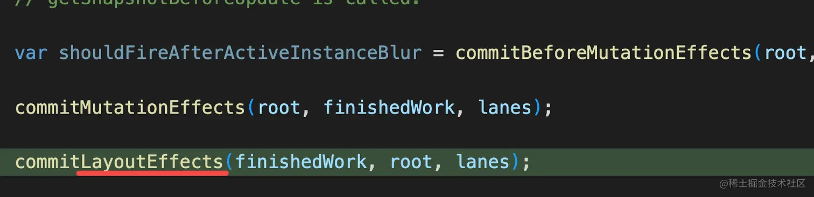

```jsx
useLayoutEffect 的effect 在 layout阶段 `commitLayoutEffects`时遍历所有fiber,取出updateQueue中每个effect执行。
```

## useState🧠

在18之前是同步调用更新，18之后是自动批处理

### mount阶段

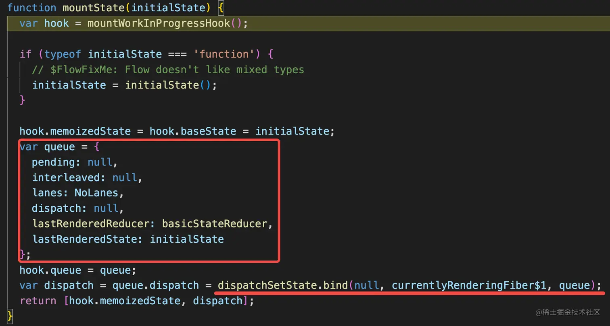

1. 将initialState 设置到hook.baseState。
2. 创建queue // 用于多个setState
3. 返回dispatch(绑定了当前fiber 和 queue)

### 触发变更

调用setState（也就是dispatch）触发变更。

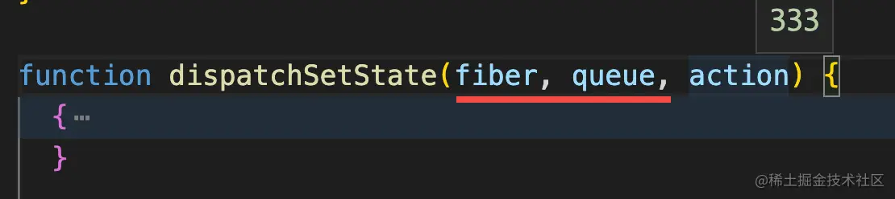

```jsx
fiber和queue是我们mount阶段时传入的参数，action是我们传入的新值。
```

dispatchSetState函数：

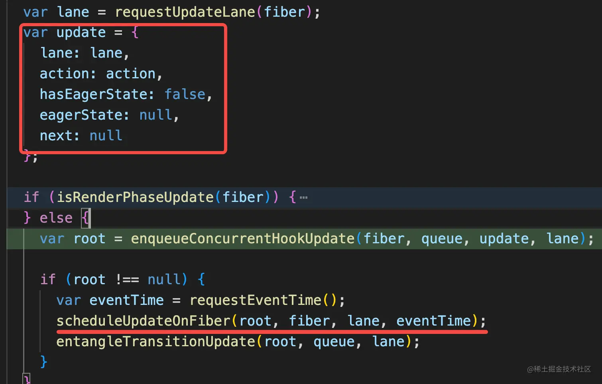

1. 创建update对象，标记fiber节点有更新[从当前fiber直到root]，调度下次渲染。
2. scheduleUpdateOnFiber 内部会调用 renderRootSync(开启新的vdom转)

### update阶段

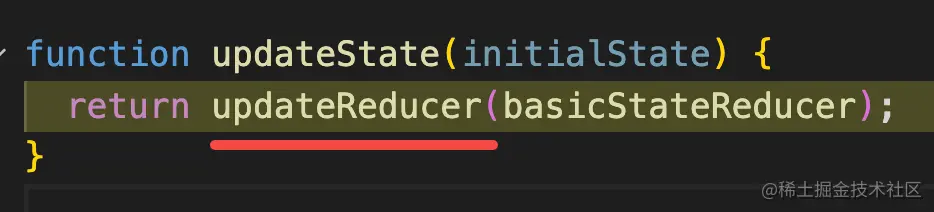

#### 多个setState，如何确定最终更新成哪个值？

```
根据lane比较，做state的合并。最后返回一个新的state。
```

# Fiber架构的意义

将单个`React element`作为`工作单元`，使以`React element`为粒度的`异步可中断的更新`成为可能。

每个`Fiber节点`对应一个` React element`,保存了该组件的类型(函数组件/类组件...)，对应的DOM节点信息。

## 架构的驱动力 -Scheduler

Scheduler

1. 时间切片
2. 优先级调度

### 时间切片

在浏览器每一帧的时间中，预留一些时间给JS线程，`React`利用这部分时间更新组件。当预留的时间不够用时，`React`将线程控制权交给浏览器使其有时间渲染UI，`React`则等待下一帧时间来继续被中断的工作。

`时间切片`的本质是模拟实现[requestIdleCallback](https://developer.mozilla.org/zh-CN/docs/Web/API/Window/requestIdleCallback)。

## 架构运行策略 -lane模型

lane模型

## Fiber树🌳

### Fiber节点🌿

每一个fiber节点对应着一个元素[组件，DOM]

```
function FiberNode(
  tag: WorkTag,
  pendingProps: mixed,
  key: null | string,
  mode: TypeOfMode,
) {
  // 作为静态数据结构的属性
  this.tag = tag;
  this.key = key;
  this.elementType = null;
  this.type = null;
  this.stateNode = null;

  // 用于连接其他Fiber节点形成Fiber树
  this.return = null;
  this.child = null;
  this.sibling = null;
  this.index = 0;

  this.ref = null;

  // 作为动态的工作单元的属性
  this.pendingProps = pendingProps;
  this.memoizedProps = null;
  this.updateQueue = null;
  this.memoizedState = null;
  this.dependencies = null;

  this.mode = mode;

  this.effectTag = NoEffect;
  this.nextEffect = null;

  this.firstEffect = null;
  this.lastEffect = null;

  // 调度优先级相关
  this.lanes = NoLanes;
  this.childLanes = NoLanes;

  // 指向该fiber在另一次更新时对应的fiber
  this.alternate = null;
}
```

#### Fiber树的遍历

先序遍历[中->左->右]

#### Fiber树的优势

DOM多叉树：

```typescript
`当前节点储存子节点信息:`
{
	...,
	children
}
`遍历节点：`
function deep(node){
    if(!node)return;
    const {value,children = []} = node;
    console.log(value);
    for(let i = 0;i<children.length;i++){
        deep(children[i])
    }
}
在DOM嵌套很深时，递归会占用大量的资源。
JS线程和GUI线程是互斥的，所以可能看到UI卡顿。
```

Fiber树：

```typescript
`Fiber节点`:
type Fiber = {
    type:any,
    //....
    child:Fiber,
    sibling:Fiber,
    return:Fiber
}
// 遍历节点
function traverse(node){
    let root = node;
    let current = node;
    while(true){
        if(current.child){
            current = current.child;
            continue;
        }
        if(current.sibling){
            current = current.sibling;
            continue;
        }
        while(!current.sibling){
            if(current.return == null || current.return == root){
				return
            }
            current = current.return;
        }
    }
}
```

1. 相比于DOM多叉树, Fiber可以摒弃递归,调用栈只使用了一层，提升了性能。
2. 允许低优先级的任务被更高优先级的任务打断。所以遍历过程可能随时被打断，所以要记录中断点。

### Fiber节点🌿

#### ClickCounter 组件

```jsx
{
    stateNode: new ClickCounter,
    type: ClickCounter,
    alternate: null,
    key: null,
    updateQueue: null, // 存储 effect 信息
    memoizedState: {count: 0}, // 存储hooks信息
    pendingProps: {},
    memoizedProps: {},
    tag: 1,
    effectTag: 0,
    nextEffect: null
}
```

#### span元素

```jsx
{
    stateNode: new HTMLSpanElement,
    type: "span",
    alternate: null,
    key: "2",
    updateQueue: null,
    memoizedState: null,
    pendingProps: {children: 0},
    memoizedProps: {children: 0},
    tag: 5,
    effectTag: 0,
    nextEffect: null
}
```

```jsx
`stateNode`:组件实例/DOM节点/其他React元素类型
`type`:定义与fiber关联的函数/类。类组件指向构造函数,DOM元素指向标签
`tag`：定义fiber类型 // 类组件/函数组件/普通DOM
`updateQueue`:状态更新，回调和DOM更新的队列[在类组件中使用的更新队列]
`memoizedState`:保存fiber的状态。在处理更新时，会反映当前在屏幕上呈现的状态。
				//在类组件中memoizedState用于保存状态(state)
				//函数组件中memoizedState用来保存hook链表
`memoizedProps`：上一次渲染期间使用的props
`pendingProps`：新的React element中的数据更新后的props，需要应用到子组件/DOM元素上。
`key`：一组节点的唯一标志，用于帮助React确定哪些元素需要增/删/改
```

## 任务优先级管理🚦

### Lane模型

1. 过期任务/同步任务使用`同步`优先级
2. 用户交互产生的更新(点击)使用更高优先级
3. 网络请求产生的更新使用一般优先级
4. `Suspense`使用低优先级


1. 如何为React不同事件添加不同的优先级？

1. createRoot创建根节点后，会为root节点添加事件监听，做事件委托。
2. 根据获取到的事件的优先级分类，设置事件触发时拥有对应优先级的回调函数


`requestIdleCallback`: 浏览器切换tab后.之前tab的`requestIdleCallback`触发的频率会变得很低。

**Scheduler**：自身实现


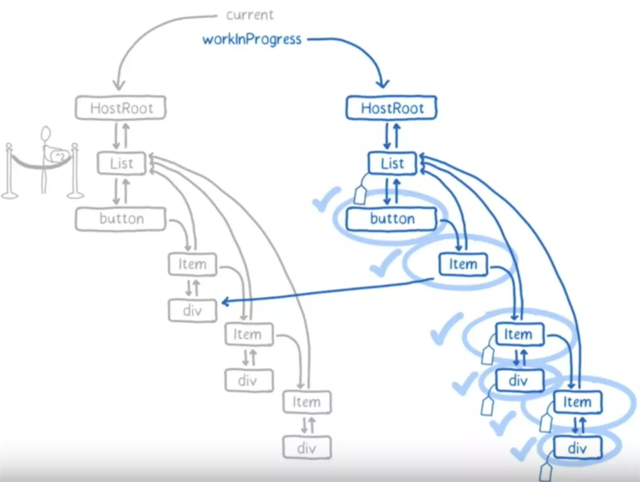

## 协调阶段📝

Reconciler  可以异步执行

**协调阶段**:用新的数据生成一个新的树，通过diff算法遍历旧树，快速找到需要更新的元素，放到更新队列中。

**⚠️**协调阶段可能被中断，恢复，甚至重做。

### 为什么可以被中断

1. 因为在当前阶段不会导致用户可见的更改

### 为什么会中断

1. 因为react得到控制权后，应该处理更高优先级的任务。中断时正在处理的任务，在恢复时会让位给更高优先级任务，原本中断的任务可能会被放弃或者重做。

## 提交阶段📌

Commit 只能同步执行

### 为什么只能同步且一次性执行

1. 因为在commit阶段执行的工作会导致用户可见的更改。例如DOM的更新

将变更操作应用到页面上。

**⚠️**不可被打断。


## Effects list

### 副作用列表

1. c2插入DOM
2. d2和c1更新属性
3. ...

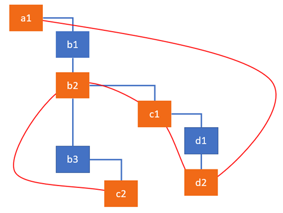

### 副作用链表


## 双缓存

# jsx⚡

ClickCounter

```jsx
<button key="1" onClick={this.onClick}>Update counter</button>
<span key="2">{this.state.count}</span>
```

babel编译👆，输出👇

```jsx
render() {
        return [
            React.createElement(
                'button',
                {
                    key: '1',
                    onClick: this.onClick
                },
                'Update counter'
            ),
            React.createElement(
                'span',
                {
                    key: '2'
                },
                this.state.count
            )
        ]
}
```

**React.createElement **处理👆，输出👇 虚拟DOM树

```jsx
[
    {
        $$typeof: Symbol(react.element),  
        type: 'button',
        key: "1",
        props: {
            children: 'Update counter',
            onClick: () => { ... }
        }
    },
    {
        $$typeof: Symbol(react.element),
        type: 'span',
        key: "2",
        props: {
            children: 0
        }
    }
]
```

# 问题

## 为什么要先将子节点插入父节点，最后再插入到浏览器？

因为如果先将父节点插入浏览器，会触发回流，再将子节点插入父节点又会触发回流，性能差

# 文档

[React Hooks useState 使用详解+实现原理+源码分析](https://juejin.cn/post/7076456859611168776)

[React技术解密](https://react.iamkasong.com/)

[一篇长文帮你彻底搞懂React的调度机制原理](https://segmentfault.com/a/1190000039101758)

[搞懂 useState 和 useEffect 的实现原理](https://juejin.cn/post/7203336895887114300?share_token=ab9a7129-05bb-4cb5-bfb1-e63b30e5c8b6)

[这可能是最通俗的 React Fiber(时间分片) 打开方式](https://juejin.cn/post/6844903975112671239)

