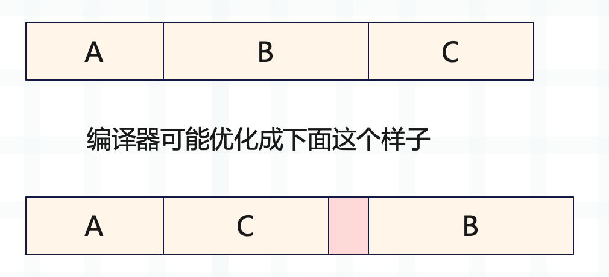
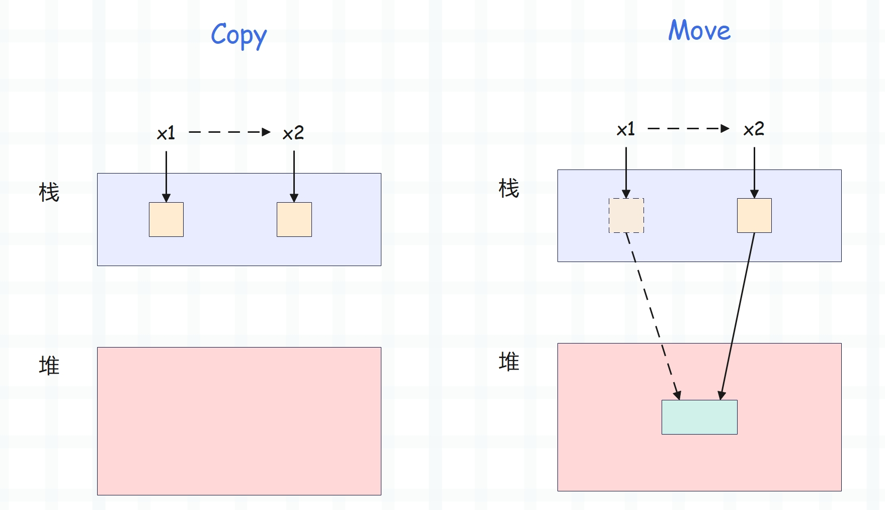
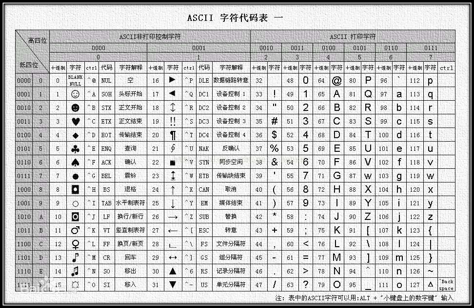

# 内存管理

【[解密 Rust 的内存管理：从创建到消亡，值都经历了什么？](https://www.cnblogs.com/traditional/p/17816444.html)】

## 字段对齐

### struct

Rust在内存中排布数据时，会根据每个字段的对齐长度将数据进行重排，使其内存大小和访问效率最好。



因为计算机CPU为了提高效率从内存中读取数据都是按照一个固定长度来读取的，以32位机器为例，它每次取32位，也就是4个字节。*如果struct的数据已对齐，可能只取一次就可以获取到，未对齐则需要两次才能获取到，影响效率。*

## Vec<T>

```rust
fn main() {
    println!("{}", std::mem::size_of::<String>());  // 24
    println!("{}", std::mem::size_of::<Vec<u8>>());  // 24
    println!("{}", std::mem::size_of::<Vec<u16>>());  // 24
    println!("{}", std::mem::size_of::<Vec<String>>());  // 24
}
```

​	不管T是什么类型，Vec的大小都是24字节。这是因为Vec的动态数据都存储在堆上，而栈上的数据是固定的，分别是【指向堆内存的指针，堆内存的长度，堆内存的容量】其实是栈上存储的一个结构体，结构体内部保存了指向堆内存的指针，只不过除了指针还有其他手段，称这样的结构体实例为**胖指针(fat pointer)**

## 所有权模型

### Copy And Move



实现了Copy，如果数据全在栈上，copy后数据彼此独立。如果涉及到堆，依旧会产生copy，只不过copy的是栈上的胖指针，堆数据不拷贝，这个过程在Rust中叫Move，一旦Move，那么所有权就发生了转移，原来的变量就不能用了。

## 自定义分配器

任何程序最基本需求是对物理内存/虚拟内存的访问。

```rust
use std::alloc::{GlobalAlloc, System, Layout};
```

一个分配器负责提供这种访问。可以把分配器想象成一个服务，接受某种请求，并返回一个(指针)内存快/一些错误。在Rust中，一个请求是一个`Layout`。

### Layout

内存分配器所需的参数。

```rust
#[lang = "alloc_layout"]
pub struct Layout {
    // 请求的内存块的大小，以字节为单位。
    size_: usize,

    // 请求的内存块的排列方式，以字节为单位。
    // 我们确保这始终是2的幂值......
    align_: NonZeroUsize,
}
```

### GlobalAlloc

实现这个trait到一个类型上后，可用通过标记 `#[global_allocator]` 属性注册为标准库默认的默认分配器

```rust
// 注意GlobalAlloc是一个trait,不是struct
pub unsafe trait GlobalAlloc {
    // required methods
    unsafe fn alloc(&self, layout: Layout) -> *mut u8;
    unsafe fn dealloc(&self, ptr: *mut u8, layout: Layout);
    // provided methods
    unsafe fn alloc_zeroed(&self, layout: Layout) -> *mut u8 { ... }
    unsafe fn realloc(
        &self, 
        ptr: *mut u8, 
        layout: Layout, 
        new_size: usize
    ) -> *mut u8 { ... }
}
```

### System

操作系统提供的默认内存分配器


# CPU密集型任务和I/O密集型任务

- CPU密集型任务是指计算量巨大，主要消耗CPU计算能力的任务。这些任务中，计算占据了绝大部分的执行时间。
- I/O密集型任务是指执行过程中大部分时间都在等待外部资源(例如网络，磁盘，数据库)的任务。由于等待I/O操作完成，CPU的利用率通常较低。I/O密集型任务的执行时间主要受I/O操作的速度限制，而不是计算速度。

## CPU密集型任务

- 科学计算
- 视频/图像处理
- 数据分析
- 机器学习训练

## I/O密集型任务

- 文件操作
- 网络请求
- 数据库操作
- 分布式系统通信：如微服务之间的数据传输


# Unicode

万国码，国际码，对世界上大部分文字进行了整理和编码。

## ASCII

美国信息交换标准码。共定义了128个字符。只需要一个字节就可以表示。



无法表示其他国家的文字。

## GB2312

中国建立的编码方式。因为中国文字较多(7000+),后续冷门生僻字和繁体字还是无法识别，又加入扩展 GBK。

## GBK

包括了GB2312所有内容，又增加了20000新的汉字(包括繁体字)和字符。之后又扩展了少数民族字符。GBK扩成了GB8030.

## Unicode

国际标准组织重新搞了一个包括地球上所有文化的字母和符号的编码，俗称Unicode。

开始制定时，直接规定必须用两个字节，也就是16位来统一表示所有的字符,对于ASCII里的半角字符，unicode保持其编码不变，只是将其长度由原来的8位扩展为16位，其他文化和语言的字符则重新统一编码。由于半角英文符号只需要用到低8位，所以高8位永远是0，所以这个方案对于用低8位就足够的编码系统来说，存储空间有点浪费，因为互联网大部分内容都是英文。

## UTF-8 

实际传输过程中，由于不同系统平台的设计不一定一致，以及出于节省空间的目的，对Unicode编码的实现方式有所不同。Unicode的实现方式称为Unicode转换格式(Unicode Transformation Format, 简称UTF)

UTF-8是为了弥补初始Unicode空间浪费的问题。因为原本ASCII中单字节就能表示的字符`0000 0001` 在Unicode中必须存 `0000 0000 0000 0001`。

### 前缀码

每个码字都不能是另外一个码字的前缀。例如码字 0，1，00，就不是前缀码，当碰到001010这样的码串，计算机读到0的时候就不能确定是哪个码。

### 可变长度

- 单个字节的字符
第一位设为0，后面的7位对应这个字符的Unicode码点。与ASCII码完全相同。因此ASCII的文档用UTF-8编码打开完全没问题。
- 需要 N 个字节的字符
第一个字节的前N位都设为1，第N+1位设为0，剩余的N-1个字节的前两位都设为10，剩下的二进制则使用这个字符的Unicode码点填充

```text
Unicode符号范围     |       UTF-8编码方式
 (十六进制)          |         （二进制）
 ----------------------+---------------------------------------------
 0000 0000-0000 007F | 0xxxxxxx
 0000 0080-0000 07FF | 110xxxxx 10xxxxxx
 0000 0800-0000 FFFF | 1110xxxx 10xxxxxx 10xxxxxx
 0001 0000-0010 FFFF | 11110xxx 10xxxxxx 10xxxxxx 10xxxxxx 
```

这样的编码方式就可以满足可变长度，节约空间。

例如读到了`1110xxxx`，那么计算机就知道除了这个再读字节，后面还有两个字节，这三个字节代表一个字符。

而后面的字节以10开头的目的是为了防止读入错误，如果不是以10开头，那么文件出现问题，前几个字符出错了，导致只能从中间读，很可能第一个字节是其他字节的后续字节，计算机会以为某个字节的开头，按照之前的顺序读取就会全部出错。如果后续字节以10开头的话，计算机在读取时就可以从一个新的字节开始。保证不会出错。

汉字等非ASCII字符，通常使用3个字符来表示：

1. 对于 U+0000 到 U+007F 的字符，使用 1 个字节表示，格式为 `0xxxxxxx`。
2. 对于 U+0080 到 U+07FF 的字符，使用 2 个字节表示，格式为 `110xxxxx 10xxxxxx`。
3. 对于 U+0800 到 U+FFFF 的字符，使用 3 个字节表示，格式为 `1110xxxx 10xxxxxx 10xxxxxx`。
4. 对于 U+10000 到 U+10FFFF 的字符，使用 4 个字节表示，格式为 `11110xxx 10xxxxxx 10xxxxxx 10xxxxxx`。

## 例如

`中`这个汉字的Unicode码是：U+4E2D。Unicode码使用三个字节表示的话格式为：

`1110xxxx` `10xxxxxx` `10xxxxxx`

`4E2D`16进制转换为2进制是`01001110 00101101`

将4E2D的2进制填充到格式中:

`11100100` `10111000` `10101101`

这样在Unicode码中⬆️3个字节就代表了中文字符`中`

## 输出

```
fn main() {
    unsafe {
        let text = "中";
        let ptr = text.as_ptr(); //获取指针,指向内存地址
        let u = ptr.as_ref(); // 指针转换成一个引用
        println!("{:?}", u);
    }
}
//输出 Some(228) 是字节值 11100100 是汉字字符'中'的开始字节⬆️

```

# 字符串

## 指针

将字符串转换成指向其内容的指针

```rust
let text = "const a = 12;";
let ptr: *const u8 = text.as_ptr();

```

ptr是指针, 类型是u8，因为指针类型是由内容类型决定的。UTF-8编码中，是由一个一个的u8字节组成。打印时会显示所指向的内存地址。

## 字符

将原始指针转换成一个引用

```rust
let u: Option<&u8> = ptr.as_ref();
```

## 字节长度

Len 获取字符串的字节长度。

```rust
let length = text.len();
```

# 宏

- 避免重复代码

宏是在编译时展开的

## 匹配语法

- `ident`：匹配一个标识符。例如，变量名、函数名、类型名等。
- `expr`：匹配一个表达式。
- `ty`：匹配一个类型。
- `pat`：匹配一个模式。
- `stmt`：匹配一个语句。
- `block`：匹配一个代码块。
- `item`：匹配一个项（例如函数、结构体、枚举等）。
- `meta`：匹配一个元项（例如属性）。
- `tt`：匹配一个标记树（token tree），可以是任意的 Rust 代码。

## 宏定义

```rust
macro_rules! ascii_byte_handler {
    ($id:ident($lex:ident) $body:expr) => {
        byte_handler!($id($lex) {
            // SAFETY: This macro is only used for ASCII characters
            unsafe {
                use assert_unchecked::assert_unchecked;
                assert_unchecked!(!$lex.source.is_eof());
                assert_unchecked!($lex.source.peek_byte_unchecked() < 128);
            }
            $body
        });
    };
}

macro_rules! byte_handler {
    ($id:ident($lex:ident) $body:expr) => {
        const $id: ByteHandler = {
            #[allow(non_snake_case)]
            fn $id($lex: &mut Lexer) -> Kind {
                $body
            }
            $id
        };
    };
}
```

## 宏使用

```rust
ascii_byte_handler!(SPS(lexer) {
    lexer.consume_char();
    Kind::Skip
});

// $id 匹配到标识符 SPS
// $lex 匹配到 lexer
// 最终生成代码⬇️：
const SPS = {
  #[allow(non_snake_case)]
  fn SPS(lexer: &mut Lexer) -> Kind {
    lexer.consume_char();
    Kind::Skip
  }
  SPS
}
```

## 使用🌰

使用宏简化字符和ascii枚举的映射。

获取字符串中的字符，转换为ascii码，与枚举中的字符比较。需要声明一个enum和一个 from_char函数，通过match进行匹配，这样需要在enum中声明一次ascii，也需要在match中每个分支上写一遍enum。重复代码较多。

使用宏后

```rust
macro_rules! define_ascii_enum {
    ($enum_name:ident { $($variant:ident = $index:expr),* $(,)? }) => {
        #[derive(Debug, PartialEq)]
        pub enum $enum_name {
            $($variant),*
        }

        impl $enum_name {
            pub fn from_char(c: char) -> Option<$enum_name> {
                let ascii_code = c as u8;
                match ascii_code {
                    $($index => Some($enum_name::$variant),)*
                    _ => None,
                }
            }
        }
    };
}

define_ascii_enum!(AsciiChar {
    Nul = 0,
    Tab = 9,          // \t
    Lf = 10,          // \n
    Cr = 13,          // \r
    Space = 32,       // 空格
  })
```


# Box

## Box::new

使用的是系统默认的堆分配器

## Box::new_in

自定义分配器

# 生命周期与借用

Rust中的借用是指对一块内存空间的「引用」。Rust有一条借用规则是借用方的生命周期不能比借出方的生命周期长。

## 引用与借用

`借用(Borrowing)`：获取变量的引用，称之为借用。

## 引用与解引用

```rust
fn main() {
    let x = 5; // x存放了一个i32的值：5.
    let y = &x; // y是x的一个引用。
    assert_eq!(5, x);
    assert_eq!(5, *y); // 比较5和y的话，要对y进行解引用。
}
```

### 借用规则

- 同一时刻，你只能拥有要么一个可变引用，要么多个不可变引用。
- 引用必须总是有效的。

## 生命周期

[细说 rust 生命周期参数](https://learnku.com/articles/44644)                                                     

- 生命周期是「引用」的生命周期。
- 生命周期是为了防止悬垂引用【确保引用的正确性】。

程序中每个变量都有一个固定的作用域，当超出变量的作用域后，变量就会被销毁。变量在作用域中从初始化到销毁的整个过程称之为生命周期。

- 在大多数时候，我们无需手动声明生命周期，因为编译器可以自动进行推导。
- 在多种类型存在时，且编译器无法推导出某个引用的生命周期时，需要我们手动标明生命周期(生命周期标注⬇️)。

### 生命周期标注

`生命周期标注并不会改变引用的实际作用，只是为了帮助编译器进行借用检查`

#### 函数中的生命周期

`在通过函数签名指定生命周期参数时，我们并没有改变传入引用或者返回引用的真实生命周期，而是告诉编译器当不满足此约束条件时，就拒绝编译通过。`

```rust
fn main() {
    let string1 = String::from("abcd");
    let string2 = "xyz";

    let result = longest(string1.as_str(), string2);
    println!("The longest string is {}", result);
}

fn longest(x: &str, y: &str) -> &str {
    if x.len() > y.len() {
        x
    } else {
        y
    }
}
```

⬆️会报错。

**报错的原因是**：longest有两个分支，返回两种结果，我们在定义该函数时，无法知道传递给函数的具体值，也不知道传入引用的生命周期，编译器的借用检查也无法推导出返回值的生命周期，因为它不知道x和y的生命周期跟返回值的生命周期之间的关系是怎样的。这样就满足了上方的规则2:在多种类型存在时，编译器无法自动推导生命周期，此时需要我们手动去标注，通过为参数标注合适的生命周期来帮助编译器进行借用检查的分析。

```rust
fn longest<'a>(x: &'a str, y:&'a str) -> &'a str {
  if a.len() > b.len() {
    x
  } else {
    y
  }
}
```

依据⬆️函数生命周期标注规则，当把具体的引用传给longest时，那`'a`的大小就是`x` 和`y`的作用域的重合部分，返回的生命周期也是`'a`。

```rust
fn main() {
    let string1 = String::from("long string is long");

    {
        let string2 = String::from("xyz");
        let result = longest(string1.as_str(), string2.as_str());
        println!("The longest string is {}", result);
    }
}
/*
string1的生命周期直到main结束，string2生命周期周期在 } 结束后结束。
'a是两者的交集，等于string2的生命周期，由于返回的也是'a，所以result的生命周期也是 string2。
编译器在检查时发现没问题，所以编译通过✅。
*/
```

```rust
fn main() {
    let string1 = String::from("long string is long");
    let result;
    {
        let string2 = String::from("xyz");
        result = longest(string1.as_str(), string2.as_str());
    }
    println!("The longest string is {}", result);
}
/*
result必须活到println！处，因为result的生命周期是'a，因此'a必须活到println！，但是result是string1和string2的交集，是string2的生命周期，小于应该具备的生命周期。所以会报错❌。
*/
```

##### 总结

`生命周期语法用来将函数的多个引用参数和返回值的作用域关联在一起，一旦关联在一起后，Rust就拥有充分的信息来确保我们的操作是内存安全的✅。`

#### 结构体生命周期

在结构体中使用引用时，只要为对应key标注生命周期即可。

```rust
struct ImportantExcerpt<'a> {
    part: &'a str,
}

fn main() {
    let novel = String::from("Call me Ishmael. Some years ago...");
    let first_sentence = novel.split('.').next().expect("Could not find a '.'");
    let i = ImportantExcerpt {
        part: first_sentence,
    };
}
```

⬆️结构体引用的字符串生命周期 >= 结构体。

```rust
#[derive(Debug)]
struct ImportantExcerpt<'a> {
    part: &'a str,
}

fn main() {
    let i;
    {
        let novel = String::from("Call me Ishmael. Some years ago...");
        let first_sentence = novel.split('.').next().expect("Could not find a '.'");
        i = ImportantExcerpt {
            part: first_sentence,
        };
    }
    println!("{:?}",i);
}
```

⬆️结构体比引用的字符串活得更久，所以会报错❌。

### 生命周期消除

```rust
fn first_word(s: &str) -> &str {
    let bytes = s.as_bytes();

    for (i, &item) in bytes.iter().enumerate() {
        if item == b' ' {
            return &s[0..i];
        }
    }

    &s[..]
}
```

⬆️函数的参数和返回值都是引用类型，尽管没有显示的为其标注生命周期，编译依然可以通过。其实是编译器为了简化用户的使用，运用了生命周期消除。

对于`first_word` ，它的返回值是一个引用类型，那么该引用只有两种情况：

- 从参数获取(返回值和参数的生命周期一样✅)
- 从函数体内部创建的变量获取。(会出现悬垂引用，被编译器拒绝❌)

#### 消除规则

1. 每一个引用参数都会获得独自的生命周期。

   ```rust
   fn foo<'a>(x: &'a i32)
   fn foo<'a, 'b>(x: &'a i32, y: &'b i32)
   ```

2. 若只有一个输入生命周期(函数参数只有一个引用类型)，那么该生命周期会被赋给所有的输出生命周期。

3. 若存在多个输入生命周期，且其中一个是`&self`或 `&mut self`，则`&self`的生命周期被赋给所有的输出生命周期。【拥有`&self`形式的参数，说明该函数是一个方法了，该规则让方法的使用便利度提升。】

以上消除规则只是编译器默认的消除规则，例如规则3，如果一个方法，它的返回值的生命周期跟参数`&self`不一样怎么办？

**手动标注生命周期**，当你标注生命周期后，会代替编译器默认的生命周期。

```rust
impl<'a> ImportantExcerpt<'a> {
    fn announce_and_return_part<'b>(&'a self, announcement: &'b str) -> &'b str {
        println!("Attention please: {}", announcement);
        self.part
    }
}

```

⬆️代码应用消除规则后会报错，因为`'a`和`'b`和生命周期关系。`&self` 的生命周期是`'a`，`self.part`的生命周期也是`'a`，但是我们为返回值制定了生命周期`'b`。因此编译器需要知道`'a`和`'b`的关系。

由于`&'a self`是被引用的一方，因此引用它的 `&'b str`生命周期应比它段。因此生命周期`'b`必须要比`'a`小。只要满足了就不会报错。

```rust
impl<'a: 'b, 'b> ImportantExcerpt<'a> {
    fn announce_and_return_part<'b>(&'a self, announcement: &'b str) -> &'b str {
        println!("Attention please: {}", announcement);
        self.part
    }
}
```

⬆️声明时确定`'b` 比`'a`生命周期小就可以了✅。

- `'b : 'a`是生命周期约束语法，跟泛型约束非常相似，用于声明`'a`比`'b`活得久。

- 可以把`'b` 和`'a`在同一个地方声明(⬆️),或者分开声明，但通过`where: 'a: 'b`约束生命周期。

  ```rust
  impl<'a, 'b> ImportantExcerpt<'a> {
      fn announce_and_return_part<'b>(&'a self, announcement: &'b str) -> &'b str 
    	where 
    			'a: 'b,
    	{
          println!("Attention please: {}", announcement);
          self.part
      }
  }
  ```

### 静态生命周期

`'static` 拥有该生命周期的引用可以和整个程序获得一样久。

```rust
let s: &'static str = "我没啥优点，就是活得久，嘿嘿";
```


# 宏

## 属性宏

### cfg_attr

条件编译属性宏，根据条件应用某个属性

```rust
#[cfg_attr(feature = "serialize"), serde(flattern)]
// serde 序列话/反序列化库。
// feature启用了serialize功能，将嵌套的结构扁平化
```

### derive

属性宏，为结构体/枚举派生属性

```rust
#derive(Debug, Hash)
```

#### 属性

##### Debug

使结构体可以使用`{:?}`格式化打印

##### Hash

使结构体/枚举可以计算哈希值，在使用哈希集合时有用。

### cfg

#### test

只有在运行测试时，下面的代码才会被编译和包含

```rust
#[cfg(test)]
mod tests {
    #[test]
    fn test_example() {
        assert_eq!(2 + 2, 4);
    }
}
```

### inline

提示编译器将标记的函数进行内联优化，内联优化是指将函数调用变为函数体本身，从而减少函数调用的开销。

但是只是一个提示，编译器会根据具体情况判断是否进行内联优化。

```rust
#[inline]
fn add(a: i32, b: i32) -> i32 {
    a + b
}
```

`#[inline(always)] ` ` #[inline(never)] `

### allow

clippy是Rust的静态代码分析工具。

当前这个属性是 允许使用通配符导入，而不触发clippy的告警。

这样会带来命名冲突的问题

```rust
#[allow(clippy::wildcard_imports)]
use crate::ast::*;
```

