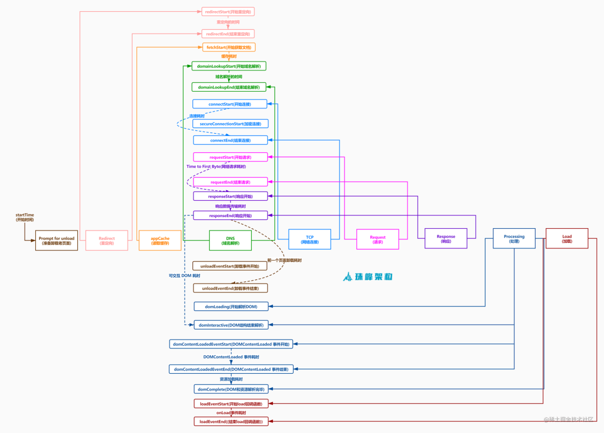

# 前端监控体系搭建

## 为什么要做前端监控

- 更快发现产品问题，解决问题
- 做产品的决策依据
- 为业务扩展提供更多可能性

## 前端监控目标

### 稳定性stability

- js错误：js执行错误，promise异常
- 资源错误：js，css资源加载异常
- 接口错误：ajax，fetch请求接口异常
- 白屏：页面空白

### 用户体验experience

### 业务business

1. pv：页面浏览量和点击量
2. uv：访问站点的不同ip的人数
3. 用户在每个页面的停留时间

## 前端监控流程

1. 前端埋点
2. 数据上报
3. 加工汇总
4. 可视化展示
5. 监控报警


### 埋点方案

#### 1.代码埋点

- 嵌入代码

```typescript
`优点：`精确(任意时刻，数据量全面)
`缺点：`工作量大，代码耦合
```

#### 2.可视化埋点

- 通过可视化交互的手段，代替代码埋点
- 将业务代码和埋点代码分离，提供一个可视化交互的页面，输入为业务代码，通过系统，可以在业务代码中自定义的增加埋点事件等等，最后输出的代码耦合了业务代码和埋点代码
- 用系统来代替手工插入埋点代码

#### 3.无痕埋点

- 前端的任意一个事件被绑定一个标识，所有的事件都被记录
- 通过定期上传记录文件，配合文件解析，解析出想要的数据，并生成可视化报告供专业人员分析

```typescript
`优点：`全量采集数据，不会出现漏埋和误埋等现象
`缺点：`数据传输和服务器增加压力，无法灵活定制数据结构
```

## 采集脚本

### 1.接入日志系统

日志系统接收数据上报，生成日志

### 2.监控错误【error】

#### 2.1错误分类

- js错误(js执行错误，promise异常)
- 资源加载异常：监听error

#### 2.2数据结构分析

- jsError

  ```json
  {
      "title": "前端监控系统", // 页面标题
      "url": "http://localhost:8080/", // 页面URL
      "timestamp": "1590815288710", // 访问时间戳
      "userAgent": "Chrome", // 用户浏览器类型
      "kind": "stability", // 大类
      "type": "error", // 小类
      "errorType": "jsError", // 错误类型
      "message": "Uncaught TypeError: Cannot set property 'error' of undefined", // 类型详情
      "filename": "http://localhost:8080/", // 访问的文件名
      "position": "0:0", // 行列信息
      "stack": "btnClick (http://localhost:8080/:20:39)^HTMLInputElement.onclick (http://localhost:8080/:14:72)", // 堆栈信息
      "selector": "HTML BODY #container .content INPUT" // 选择器
  }
  ```

- promiseError

  ```json
  {
      ...
      "errorType": "promiseError",//错误类型 
      "message": "someVar is not defined",//类型详情
      "stack": "http://localhost:8080/:24:29^new Promise (<anonymous>)^btnPromiseClick (http://localhost:8080/:23:13)^HTMLInputElement.onclick (http://localhost:8080/:15:86)",//堆栈信息 
      "selector": "HTML BODY #container .content INPUT"//选择器
  }
  ```

- resourceError

  ```json
  {    ...
      "errorType": "resourceError",//错误类型
      "filename": "http://localhost:8080/error.js",//访问的文件名
      "tagName": "SCRIPT",//标签名
      "timeStamp": "76",//时间 
  }
  ```

### 3.接口异常采集脚本【xhr,fetch】

#### 1.数据结构

```json
{
  "title": "前端监控系统", //标题
  "url": "http://localhost:8080/", //url
  "timestamp": "1590817024490", //timestamp
  "userAgent": "Chrome", //浏览器版本
  "kind": "stability", //大类
  "type": "xhr", //小类
  "eventType": "load", //事件类型
  "pathname": "/success", //路径
  "status": "200-OK", //状态码
  "duration": "7", //持续时间
  "response": "{\"id\":1}", //响应内容
  "params": "" //参数
}
```

#### 2.实现方式

- 重写xhr的open，send方法
- 监听load，error，abort事件

#### 3.fetch监听

```
fetch是内置于浏览器的方法，fetch内部使用xhr,虽然我们监听了xhr，但是promise是内置的优于我们重写的xhr，所以只能重写fetch。
```

### 4.白屏【blank】

#### 1.数据结构

```json
{
  "title": "前端监控系统",
  "url": "http://localhost:8080/",
  "timestamp": "1590822618759",
  "userAgent": "chrome",
  "kind": "stability", //大类
  "type": "blank", //小类
  "emptyPoints": "0", //空白点
  "screen": "2049x1152", //分辨率
  "viewPoint": "2048x994", //视口
  "selector": "HTML BODY #container" //选择器
}
```

#### 2.实现方式

- elementsFromPoint 获取水平/竖直中线所在的元素

### 5.加载时间

- PerformanceTiming
- DOMContentLoaded
- FMP

#### 1.加载阶段


| 字段                       | 含义                                                         |
| :------------------------- | :----------------------------------------------------------- |
| navigationStart            | 初始化页面，在同一个浏览器上下文中前一个页面unload的时间戳，如果没有前一个页面的unload则与fetchStart值相等 |
| redirectStart              | 第一个HTTP重定向发生的时间,有跳转且是同域的重定向,否则为0    |
| redirectEnd                | 最后一个重定向完成时的时间,否则为0                           |
| fetchStart                 | 浏览器准备好使用http请求获取文档的时间,这发生在检查缓存之前  |
| domainLookupStart          | DNS域名开始查询的时间,如果有本地的缓存或keep-alive则时间为0  |
| domainLookupEnd            | DNS域名结束查询的时间                                        |
| connectStart               | TCP开始建立连接的时间,如果是持久连接,则与fetchStart值相等    |
| secureConnectionStart      | https 连接开始的时间,如果不是安全连接则为0                   |
| connectEnd                 | TCP完成握手的时间，如果是持久连接则与fetchStart值相等        |
| requestStart               | HTTP请求读取真实文档开始的时间,包括从本地缓存读取            |
| requestEnd                 | HTTP请求读取真实文档结束的时间,包括从本地缓存读取            |
| responseStart              | 返回浏览器从服务器收到（或从本地缓存读取）第一个字节时的Unix毫秒时间戳 |
| responseEnd                | 返回浏览器从服务器收到（或从本地缓存读取，或从本地资源读取）最后一个字节时的Unix毫秒时间戳 |
| unloadEventStart           | 前一个页面的unload的时间戳 如果没有则为0                     |
| unloadEventEnd             | 与unloadEventStart相对应，返回的是unload函数执行完成的时间戳 |
| domLoading                 | 返回当前网页DOM结构开始解析时的时间戳,此时document.readyState变成loading,并将抛出 |
| domInteractive             | 返回当前网页DOM结构结束解析、开始加载内嵌资源时时间戳,document.readyState 变成 |
| domContentLoadedEventStart | 网页domContentLoaded事件发生的时间                           |
| domContentLoadedEventEnd   | 网页domContentLoaded事件脚本执行完毕的时间,domReady的时间    |
| domComplete                | DOM树解析完成,且资源也准备就绪的时间,document.readyState变成complete.并将抛出readystatechange事件 |
| loadEventStart             | load 事件发送给文档，也即load回调函数开始执行的时间          |
| loadEventEnd               | load回调函数执行完成的时间                                   |

#### 2阶段计算

| 字段             | 描述                                 | 计算方式                                              | 意义                                                         |
| ---------------- | ------------------------------------ | ----------------------------------------------------- | ------------------------------------------------------------ |
| unload           | 前一个页面卸载耗时                   | unloadEventEnd – unloadEventStart                     | -                                                            |
| redirect         | 重定向耗时                           | redirectEnd – redirectStart                           | 重定向的时间                                                 |
| appCache         | 缓存耗时                             | domainLookupStart – fetchStart                        | 读取缓存的时间                                               |
| dns              | DNS 解析耗时                         | domainLookupEnd – domainLookupStart                   | 可观察域名解析服务是否正常                                   |
| tcp              | TCP 连接耗时                         | connectEnd – connectStart                             | 建立连接的耗时                                               |
| ssl              | SSL 安全连接耗时                     | connectEnd – secureConnectionStart                    | 反映数据安全连接建立耗时                                     |
| ttfb             | Time to First Byte(TTFB)网络请求耗时 | responseStart – requestStart                          | TTFB是发出页面请求到接收到应答数据第一个字节所花费的毫秒数   |
| response         | 响应数据传输耗时                     | responseEnd – responseStart                           | 观察网络是否正常                                             |
| dom              | DOM解析耗时                          | domInteractive – responseEnd                          | 观察DOM结构是否合理，是否有JS阻塞页面解析                    |
| dcl              | DOMContentLoaded 事件耗时            | domContentLoadedEventEnd – domContentLoadedEventStart | 当 HTML 文档被完全加载和解析完成之后，DOMContentLoaded 事件被触发，无需等待样式表、图像和子框架的完成加载 |
| resources        | 资源加载耗时                         | domComplete – domContentLoadedEventEnd                | 可观察文档流是否过大                                         |
| domReady         | DOM阶段渲染耗时                      | domContentLoadedEventEnd – fetchStart                 | DOM树和页面资源加载完成时间，会触发`domContentLoaded`事件    |
| 首次渲染耗时     | 首次渲染耗时                         | responseEnd-fetchStart                                | 加载文档到看到第一帧非空图像的时间，也叫白屏时间             |
| 首次可交互时间   | 首次可交互时间                       | domInteractive-fetchStart                             | DOM树解析完成时间，此时document.readyState为interactive      |
| 首包时间耗时     | 首包时间                             | responseStart-domainLookupStart                       | DNS解析到响应返回给浏览器第一个字节的时间                    |
| 页面完全加载时间 | 页面完全加载时间                     | loadEventStart - fetchStart                           | -                                                            |
| onLoad           | onLoad事件耗时                       | loadEventEnd – loadEventStart                         |                                                              |


#### 3.数据结构

```json
{
  "title": "前端监控系统",
  "url": "http://localhost:8080/",
  "timestamp": "1590828364183",
  "userAgent": "chrome",
  "kind": "experience",
  "type": "timing",
  "connectTime": "0",
  "ttfbTime": "1",
  "responseTime": "1",
  "parseDOMTime": "80",
  "domContentLoadedTime": "0",
  "timeToInteractive": "88",
  "loadTime": "89"
}
```

#### 4.实现

- performance.timing

### 6.性能指标

| 字段 | 描述                                     | 备注                                                         | 计算方式 |
| :--- | :--------------------------------------- | :----------------------------------------------------------- | :------- |
| FP   | First Paint(首次绘制)                    | 包括了任何用户自定义的背景绘制，它是首先将像素绘制到屏幕的时刻 |          |
| FCP  | First Content Paint(首次内容绘制)        | 是浏览器将第一个 DOM 渲染到屏幕的时间,可能是文本、图像、SVG等,这其实就是白屏时间 |          |
| FMP  | First Meaningful Paint(首次有意义绘制)   | 页面有意义的内容渲染的时间                                   |          |
| LCP  | (Largest Contentful Paint)(最大内容渲染) | 代表在viewport中最大的页面元素加载的时间                     |          |
| DCL  | (DomContentLoaded)(DOM加载完成)          | 当 HTML 文档被完全加载和解析完成之后, DOMContentLoaded 事件被触发，无需等待样式表、图像和子框架的完成加载 |          |
| L    | (onLoad)                                 | 当依赖的资源全部加载完毕之后才会触发                         |          |
| TTI  | (Time to Interactive) 可交互时间         | 用于标记应用已进行视觉渲染并能可靠响应用户输入的时间点       |          |
| FID  | First Input Delay(首次输入延迟)          | 用户首次和页面交互(单击链接，点击按钮等)到页面响应交互的时间 |          |

#### 1.数据结构

##### paint

```json
{
  "title": "前端监控系统",
  "url": "http://localhost:8080/",
  "timestamp": "1590828364186",
  "userAgent": "chrome",
  "kind": "experience",
  "type": "paint",
  "firstPaint": "102",
  "firstContentPaint": "2130",
  "firstMeaningfulPaint": "2130",
  "largestContentfulPaint": "2130"
}
```

##### firstInputDelay

```typescript
{
  "title": "前端监控系统",
  "url": "http://localhost:8080/",
  "timestamp": "1590828477284",
  "userAgent": "chrome",
  "kind": "experience",
  "type": "firstInputDelay",
  "inputDelay": "3",
  "duration": "8",
  "startTime": "4812.344999983907",
  "selector": "HTML BODY #container .content H1"
}
```

#### 2.实现

`performance.timing`

### 7.卡顿

#### 1.数据结构

```typescript
{
  "title": "前端监控系统",
  "url": "http://localhost:8080/",
  "timestamp": "1590828656781",
  "userAgent": "chrome",
  "kind": "experience",
  "type": "longTask",
  "eventType": "mouseover",
  "startTime": "9331",
  "duration": "200",
  "selector": "HTML BODY #container .content"
}
```

#### 2.实现

`PerformanceObserver` 判定`duration `，如果>100 ，认定是长任务。

使用`requestIdleCallback`上报任务

### 8.PV,UV,用户停留时间

#### 1.数据结构

```json
{
  "title": "前端监控系统",
  "url": "http://localhost:8080/",
  "timestamp": "1590829304423",
  "userAgent": "chrome",
  "kind": "business",
  "type": "pv",
  "effectiveType": "4g",
  "rtt": "50",
  "screen": "2049x1152"
}
```

#### 2.PV,UV,用户停留时间

`pv `：页面浏览量，只要用户进入页面一次就上报一次

`uv `：用户访问量，放在服务器做。

`停留时间`：beforeunload

# 扩展问题

## 1.性能监控指标

| 指标 | 名称                                  | 解释                                                         |
| :--- | :------------------------------------ | :----------------------------------------------------------- |
| FP   | First-Paint 首次渲染                  | 表示浏览器从开始请求网站到屏幕渲染第一个像素点的时间         |
| FCP  | First-Contentful-Paint 首次内容渲染   | 表示浏览器渲染出第一个内容的时间，这个内容可以是文本、图片或SVG元素等等，不包括iframe和白色背景的canvas元素 |
| SI   | Speed Index 速度指数                  | 表明了网页内容的可见填充速度                                 |
| LCP  | Largest Contentful Paint 最大内容绘制 | 标记了渲染出最大文本或图片的时间                             |
| TTI  | Time to Interactive 可交互时间        | 页面从开始加载到主要子资源完成渲染，并能够快速、可靠的响应用户输入所需的时间 |
| TBT  | Total Blocking Time 总阻塞时间        | 测量 FCP 与 TTI 之间的总时间，这期间，主线程被阻塞的时间过长，无法作出输入响应 |
| FID  | First Input Delay 首次输入延迟        | 测量加载响应度的一个以用户为中心的重要指标                   |
| CLS  | Cumulative Layout Shift 累积布局偏移  | 测量的是整个页面生命周期内发生的所有意外布局偏移中最大一连串的布局偏移分数 |
| DCL  | DOMContentLoaded                      | 当初始的 HTML 文档被完全加载和解析完成之后，DOMContentLoaded 事件被触发，而无需等待样式表、图像和子框架的完成加载 |
| L    | Load                                  | 检测一个完全加载的页面，页面的html、css、js、图片等资源都已经加载完之后才会触发 load 事件 |

## 2.前端怎么做性能监控

- FP、FCP、LCP、CLS、FID、FMP 可通过 `PerformanceObservre`获取
- TCP连接耗时、首字节到达时间、response响应耗时、DOM解析渲染的时间、TTI、DCL、L等可通过`performance.timing`获取
- 长任务监听，PerformanceObserver 监听 `longTask`

## 3.线上错误监控怎么做

- 资源加载错误 window.addEventListener('error') 判断e.target.src || href
- js运行时错误 window.addEventListener('error')
- promise异常 window.addEventListener('unhandledrejection')
- 接口异常 重写xhr 的 open send方法，监控 load、error、abort，进行上报

## 4.导致内存泄漏的方法，怎么监控内存泄漏

- 全局变量
- 被遗忘的定时器
- 脱离Dom的引用
- 闭包

### 监控内存泄漏

`performance.memory`

- 开发阶段
  - 浏览器的 Performance
  - 移动端可使用 PerformanceDog