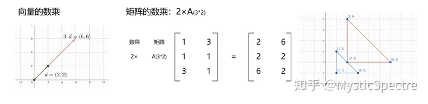

# 矩阵

## 矩阵相乘的几何意义

`伸缩` `旋转`

[矩阵相乘的几何意义](https://zhuanlan.zhihu.com/p/133631891)：将一个坐标系中所有的点映射到另一个坐标系中去【坐标系转换，从一个空间转换到另一个空间】。



## 矩阵加法的几何意义

`平移`

1. 相同m*n的矩阵才能相加
2. 交换律  A+B+C = A+C+B
3. 结合律   A+B+C = A+(C+B)


A: 2*3;   2行3列

B: 3*2;   3行2 列

相乘：A的行每一项*B的列每一项后相加 得出的结果 作为新矩阵坐标 [行 ] [列] 的结果

结果：2行2列的矩阵

```
A = [
 [2,3,-1],
 [6,1,-2]
];
B = [
 [4,-5],
 [-3,0],
 [1,2]
]

C = A * B;
A 第0行 和 B第0列相乘：   2*4 +3*-3 + -1*1 = -2      C[0][0] = -2
```

# 题

## 1.矩阵乘法计算量估算

```typescript
A是一个50×10的矩阵，B是10×20的矩阵，C是20×5的矩阵
计算A*B*C有两种顺序：((AB)C)或者(A(BC))，前者需要计算15000次乘法，后者只需要3500次。
编写程序计算不同的计算顺序需要进行的乘法次数。

数据范围：矩阵个数：1≤n≤15 ，行列数：1≤row,col≤100 ，

输入：
    3
    50 10
    10 20
    20 5
    (A(BC))
输出：
	3500

```

