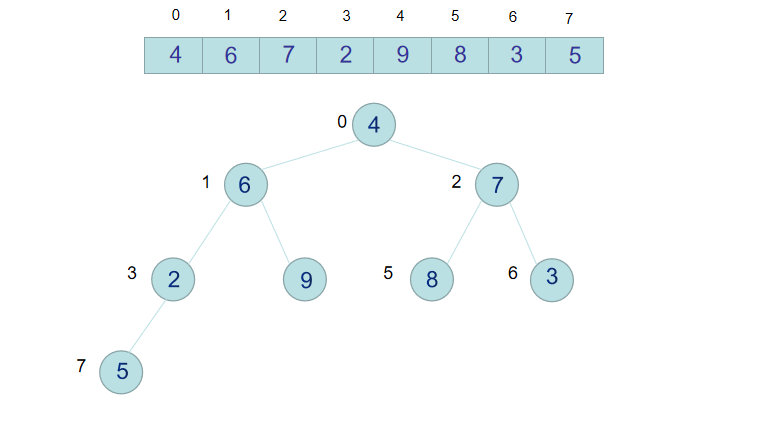

**稳定性：**

```
假定在待排序的记录序列中，存在多个具有相同的关键字的记录，若经过排序，这些记录的相对次序保持不变，即在原序列中，     r[i]=r[j]，且r[i]在r[j]之前，而在排序后的序列中，r[i]仍在r[j]之前，则称这种排序算法是稳定的；否则称为不稳定的。
```

**时间复杂度:**

```
对排序数据的总的操作次数，反映当n变化时，操作此时呈现的规律
```

**空间复杂度：**

```
是指算法在计算机内执行时所需存储空间的度量，它也是数据规模n的函数。
```

# 排序(10)

## 比较类排序

### 插入排序

#### 直接插入排序

```javascript
*将一个元素插入到已排好序的序列中，从而得到一个新的有序序列【默认第一个元素是已排序好的序列】
从第二个元素开始，将数组中的所有元素依次和前面的已经排好序的元素比较，根据比较结果，调换位置。
let arr = [9, 5, 8, 4, 2, 6, 7];
for (let i = 1; i < arr.length; i += 1) {
        for (let j = i - 1; j >= 0; j -= 1) {
            if (arr[j] > arr[j + 1]) {
                [arr[j], arr[j + 1]] = [arr[j + 1], arr[j]];
            } else {
                break;
            }
        }
    }

最好时间复杂度：已经排序好，比较n-1次，没有移动元素，时间复杂度O(n)
最坏时间复杂度：逆序，比较了n(n-1)/2次，移动(n+2)(n-2)/2次，时间复杂度O(n^2)
空间复杂度：O(1)
稳定性：好
```

#### 希尔排序


```javascript
别名：`缩小增量排序`;
直接插入排序的改进：
	当n值很大时数据项每一趟排序需要移动的个数很少，但数据项的距离很长。当n值减小时每一趟需要移动的数据增多，此时已经接近于它们排序后的最终位置

根据下标按照一定的增量进行分组使用直接插入排序,完成后在更改增量，直至增量为1。
增量gap = source/2 -> gap = (source/2)/2.....

function shellSort(arr) {
    let step = Math.floor(arr.length / 2);
    while (step >= 1) {
        for (let i = 0; i < arr.length; i++) {
            let j = i;
            while (j > 0) {
                if (j - step >= 0 && arr[j] < arr[j - step]) {
                    [arr[j], arr[j-step]] = [arr[j-step],arr[j]]
                    j -= step;
                } else {
                    break;
                }
            }
        }
        step = Math.floor(step / 2);
    }
}

稳定性：不稳定
最好时间复杂度：O(nlog2n)
最坏时间复杂度：O(nlog2n)
空间复杂度：O()

`跨索引进行插入排序` 减少比较和移动的距离
step          [0，step，step*2，step*3]
step/2        [0,step/2,step,step/2*3]
step/2/2      [0,step/2/2，step/2,....]
1             [0,1,2,3,4,5,6,...]
               
5             [0,5] [1,6],[2,7],[3,8],[4,9]     分5组，进行插入排序
2             [0,2,4,6,8],[1,3,5,7]             分两组，进行插入排序
1             [0,1,2,3,4,5,6,7,8]               分1组，进行插入排序
```

### 选择类排序

#### 简单选择排序

```javascript
1）从待排序的序列中找到最值，存放在排序序列的起始位置，
2）然后从待排序的序列中，找到最最值，如果最值不是待排序序列的第一个元素，交换位置，之后重复。
let arr = [4,2,7,9,4,0,1];
for(let i = 0;i < arr.length;i++){
    let nextValue = arr[i+1],nextIndex = i+1;
    for(let j = i;j < arr.length; j++){
        if(nextValue > arr[j]){
            nextValue = arr[j];
            nextIndex = [j];
        }
    }
    if(nextValue < arr[i]){
        [arr[nextIndex],arr[i]] = [arr[i],arr[nextIndex]]
    }
}
稳定性：不稳定【8,6,8,4,5】第一次获取最小值就不稳定了
最好时间复杂度：O(n^2)
最坏时间复杂度：O(n^2)
空间复杂度：O(1)
```

#### 堆排序



```javascript
堆是具有以下性质的完全二叉树：
	每个结点的值都大于或等于其左右孩子结点的值，称为大顶堆；或者每个结点的值都小于或等于其左右孩子结点的值，称为小顶堆
大顶堆：arr[i] >= arr[2*i+1] && arr[i] >= arr[2*i+2]  
小顶堆：arr[i] <= arr[2*i+1] && arr[i] <= arr[2*i+2]

堆排序的基本思想是：
	1-将待排序序列构造成一个大顶堆，此时，整个序列的最大值就是堆顶的根节点。
    2-将其与末尾元素进行交换，此时末尾就为最大值。
    3-然后将剩余n-1个元素重新构造成一个堆，这样会得到n个元素的次小值。如此反复执行，便能得到一个有序序列了

0，1，2，3，4，5，6，7，8，9,10
↑,↑,↑,↑,↑,↑
构建初始堆的步骤主要是：非叶子节点必须大于或者小于其子节点。
非叶子节点: 0- Math.floor(source.length/2)-1
对应左右子节点：2n+1，2n+2
*注意：调整后可能影响非叶子节点，需要修非叶子节点的结构。

`【倒序从最后一个非叶子节点向上推元素，遍历到堆顶时也寻找到了最值】`

let source = [4,6,8,5,9],end =  source.length-1
function Initheap(){
    for(let index = Math.floor((end-1)/2); index>=0; index--){
        fix(index)
    } 
}
/* 可能没有right节点*/
function fix(index){
    let left = 2*index+1,right = 2*index+2, hasRight = 2*index+2 <=end
        leftValue = source[left], rightValue=  hasRight ? source[right] : -Infinity ;
    if(source[index] < leftValue || source[index] < rightValue){
        if(rightValue >= leftValue){
            [source[index],source[right]] = [source[right],source[index]]
        }else{
            [source[index],source[left]] = [source[left],source[index]]
        }
    }
}
function swap(){
    [source[0],source[end]] = [source[end],source[0]]
}
function heapSort(){
    while(end > 0){
          Initheap();
          swap();
          end--;
    }
}
heapSort();


稳定性：不稳定
最好时间复杂度：O()
最坏时间复杂度：O()
空间复杂度：O()
```

### 交换类排序

#### 冒泡排序

```javascript
连续比较相邻元素的大小，大的元素不断后移，每一轮下沉一个待排序元素中的最大值。
let arr = [4,1,0,7,9,5,2,8,3];

for(let j = arr.length-1; j >=0; j-- ){
    for(let i = 0; i< j;i++){
        if(arr[i] > arr[i+1]){
            [arr[i],arr[i+1]] = [arr[i+1],arr[i]]
        }
	}
}

稳定性：稳定
最好时间复杂度：O(n)
最坏时间复杂度：O(n^2)
空间复杂度：O()
```

#### 快速排序

```javascript
以一个元素为基准，通过第一次排序将待排序元素分为两部分，一部分比基准大一部分比基准小，
选取第一个元素(i = 0)为基准。数据从 [i - j]分为两部分
步骤:
基准数据索引：i
数据起始索引：i
数据结束索引：j
双指针：i,j
i放在数据起始位置，j放在结束位置，将i，j数据与基准值对比，i需要<=基准值，j>=基准值，当不满足条件时，交换位置，再对比，直到i==j;此时i及i左侧的值都<=基准值，i右侧的都>=基准值;交换基准值和中点值;这样下次就不会使用基准值比较【完成第一次排序】;

在第一次排序好后，再以中点 i 将数据分为两部分 from -> i-1 ; i+1 -> end,继续上述步骤
直到 待排序的数据的 from >= end;

let resource = [4,40,7,1,1,9,3,8,4,4,4];

function quickSort(left, right){
    if(left >= right) return ;
    let i = left,
        j = right,
        base = resource[left];
    while(i < j){
        while(i < j && resource[j] >= base){
            j--;
        }
        while(i <j && resource[i] <= base){
            i++
        }
        if(i<j){
            [resource[i],resource[j]] = [resource[j],resource[i]]
        }
    }
    //因为使用的判断条件是【resource[j] >= base，resource[i] <= base】，因此当第一次排序完成后，基准点还在初始位置，需要把基准点放到中间，以将 两个部分切割
    [resource[left],resource[i]] = [resource[i],resource[left]]
    quickSort(left, i-1);
    quickSort(i+1, right);
}
稳定性：不稳定
最好时间复杂度：O(nlogn)
最坏时间复杂度：O(n^2)
空间复杂度：O()
```

### 归并类排序

分治思想，先分组排序，再合并排序【合并已经排序好的两个数组】

#### 归并排序

```javascript
把长度为n的输入序列分成两个长度为n/2的子序列；
对这两个子序列分别采用归并排序；
将两个排序好的子序列合并成一个最终的排序序列。

let resource = [2,4,7,9,0,4,7,1,4];

function MergeSort(arr,from,end){
    if(arr.length < 2) return arr;
    let mid = Math.floor((end + from)/2),
        left = resource.slice(from,mid+1),
        right = resource.slice(mid+1,end+1);
    return merge(MergeSort(left,from,mid), MergeSort(right,mid+1,end));
    
}
function merge(left, right) {
    let arr = [];
    while (left.length && right.length) {
        let l = left.shift(),
            r = right.shift();
        if (l > r) {
            arr.push(r);
            left.unshift(l);
        } else {
            arr.push(l);
            left.unshift(r);
        }
    }
    return arr.concat(left, right);
}

console.log(MergeSort(resource,0,8));
稳定性：
最好时间复杂度：O(n)
最坏时间复杂度：O(nlogn)
空间复杂度：O(nlogn)
```

## 非比较排序

### 计数排序

```typescript
计数排序的核心在于将输入的数据值转化为键存储在额外开辟的数组空间中。 作为一种线性时间复杂度的排序，计数排序要求输入的数据必须是有确定范围的整数
计数排序 是一种稳定的排序算法。计数排序使用一个额外的数组C，其中第i个元素是待排序数组A中值等于i的元素的个数。然后根据数组C来将A中的元素排到正确的位置。它只能对整数进行排序。

function countSort(arr){
    const box = [],max,result = [];
    for(let i = 0,len = arr.length; i<len;i++){
        if(max == undefined){
            max = arr[i]
        }else{
            max = Math.max(max,arr[i])
        }
        if(box[arr[i]]){
            box[arr[i]]++
        }else{
            box[arr[i]] = 1
        }
    }
    for(let i=0,len=max;i<=max;i++){
        if(box[i]){
            for(let begin = 0,length = box[i].length;begin<length;begin++){
                result.push(i)
            }
        }
    }
    return result;
}

优化：确定max,min，根据max,min确定数组长度

稳定性：稳定
最好时间复杂度：O(n+k)
最坏时间复杂度：O(n+k)
空间复杂度：O()
```

### 桶排序

```
桶排序 是计数排序的升级版。它利用了函数的映射关系，高效与否的关键就在于这个映射函数的确定。
桶排序 工作的原理：
假设输入数据服从均匀分布，将数据分到有限数量的桶里，每个桶再分别排序

桶：[[0-9],[10-19],....]

稳定性：取决于桶内排序的方式
最好时间复杂度：O(n+k)
最坏时间复杂度：O(n+k)
```

### 基数排序

```typescript
基数排序也是非比较的排序算法，对每一位进行排序，从最低位开始排序，复杂度为O(kn),n为数组长度，k为数组中的数的最大的位数
基数排序是按照低位先排序，然后收集；再按照高位排序，然后再收集；依次类推，直到最高位。有时候有些属性是有优先级顺序的，先按低优先级排序，再按高优先级排序。最后的次序就是高优先级高的在前，高优先级相同的低优先级高的在前。基数排序基于分别排序，分别收集，所以是稳定的。

分成0-9，十个桶，
第一轮检查个位数，放到桶中，
取出所有数据，拼接成数组；
第二轮再检查十位数，放到桶中，
取出所有数据；
....
....
直到循环数据的最高位数。

const source = [1,45,78,123,56,34,67,32] 
function baseSort(arr){
	const base = {
          base0:[],
          base1:[],
          base2:[],
          base3:[],
          base4:[],
          base5:[],
          base6:[],
          base7:[],
          base8:[],
          base9:[],
    },max;
    for(let i = 0,len = arr.length;i<len,i++){
        max = 
    }
    
        
}


【在循环的过程中，小的值不断的前移，大的值后移，移动完成代表比较完成。得出排序好的序列】

稳定性：不稳定
最好时间复杂度：O()
最坏时间复杂度：O()
```


### 