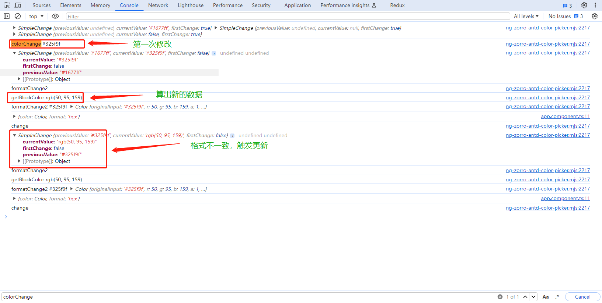

### Angular-schematics

```typescript
`原因：`【资产管理】多是列表，搜索，树，添加，删除，新增，编辑；【逻辑一样，接口不同，工作重复】
`解决：`【基于Angular-schematics】将label，字段，接口，布局，做成object格式的，搭配UI库的标准，生成特定的页面
```

### Angular-vite

```typescript
`原因：`【Angular项目启动慢，编译慢，每次更改文件后需要大量时间重新编译】
`解决：`【vite】使用ES6的import，
              按需编译，不需要预编译，分析模块间的依赖关系
              预编译，将【dependencies】进行预编译，然后将编译的结果缓存
              使用es-bulder，编译typescript 更快
`遇到的问题` 1.Angular有预解析，将templateUrl和stylesUrl转换成对应字符串
		   2.ts转换Angular文件会特殊处理params注入，使用esbuild 会丢失，只能使用参数修饰符
```

### canvas滚动

```typescript
`原因`：g6加入滚动功能后，会超出边界，并且无法再滚动回来
`解决`：记录滚动一次，canvas上的节点在画布上移动的距离，根据各类节点的间距及高度，计算滚动的最大距离，
       根据浏览器的支持mousewheel方式【deltaY，wheelDelta，detail】判断滚动的方向及距离；
       超出范围时，应销毁滚动事件【劫持的是g6的滚送事件，不能销毁，只能暂存，当滚动在范围内时，再将事件加进去】
```

### 微前端

```
customElement + HTMLEntry
```

### 页面截图

```typescript
`原因`: html2canvas 无法解析 外链svg,截图时页面是空白
`解决`：
	1. 转换svg外链为内嵌,html2canvas就可以正常解析
		使用symbol内的数据代替use标签。
    2. 使用div包裹svg，样式设置为flex/inline-flex 等属性，否则高度有误差    

```

### Angular@10 web component

```typescript
`原因`: 转义后的web component 在extends时，依赖注入功能消失
`解决`: 将web component挂载到iframe，web component会自执行，在web component将注入的依赖添加到web component 的static上，在extends时，再在super中注入依赖。

http: 可循环使用 [注入super的http];
cd: 不可循环，只能使用本组件的 [每个cd都是当前view的];
```

# 技术难点

## canvas滚动

```typescript
`原因`：g6加入滚动功能后，会超出边界，并且无法再滚动回来
`解决`：记录滚动一次，canvas上的节点在画布上移动的距离，根据各类节点的间距及高度，计算滚动的最大距离，
       根据浏览器的支持mousewheel方式【deltaY，wheelDelta，detail】判断滚动的方向及距离；
       超出范围时，应销毁滚动事件【劫持的是g6的滚送事件，不能销毁，只能暂存，当滚动在范围内时，再将事件加进去】
```

## leaflet + echarts

```typescript
`原因`：为了满足业务需求和UI风格统一
`库`： leaflet + echarts
`可行性分析：`
1. 百度地图bMap支持与echarts联合为leaflet+echarts提供了可行性。
2. leaflet 是由 map(base layers) + map-pane(overlayers)实现的视图的叠加，结构清晰，因此可通过一层layer添加echarts。
`难点：`
1. 经纬度与偏移映射
2. echarts与leaflet事件交互[平移，缩放]
3. echarts与用户的交互
4. echarts的销毁/创建
`解决：`
1. 使用leaflet内的经纬度转换代替echarts的经纬度转换[leaflet经纬度和echarts经纬度相反]
2. 确定map-pane原点，原点在地图平移时会偏移，但在地图缩放时不会移动，缩放时，会重置原map-pane点,移动内部的layer。因此在缩放时，移动echarts的layer就可以满足，而echarts需要根据map基础原点获取像素数据，进行偏移
3. 暴露最新的echarts的实例
4. 每次在地图缩放/移动时，都需要更新ecahrts图层

   
``
每张地图的切片256*256
```

# ng-zorro-antd



## 问题

colorPick 组件 颜色变化会触发两次 nzOnChange 事件。

## 原因

```typescript
formatChange(value) {
    console.log('二次更新')
    this.nzValue = value.color;
    this.clearColor = false;
    this.getBlockColor();
    this.nzOnChange.emit({ color: generateColor(value.color), format: value.format });
    this.formControl.patchValue(value.color);
    this.cdr.markForCheck();
}
getBlockColor() {
    if (!!this.nzValue) {
        this.blockColor = generateColor(this.nzValue).toRgbString();
    }
    else if (!!this.nzDefaultValue) {
        this.blockColor = generateColor(this.nzDefaultValue).toRgbString();
    }
    else {
        this.blockColor = defaultColor.toHexString();
    }
}
```

1. NgAntdColorPickerComponent颜色修改 触发 NzColorPickerComponent 的colorChange
2. colorChange 修改 blockColor 
3. NzColorFormatComponent 接收 blockColor 作为 colorValue，blockColor 变化时patchValue修改自己的validateForm
4. NzColorFormatComponent 监听自身validateForm的变化，formatChange事件emit出新的数据
5. NgAntdColorPickerComponent 监听formatChange事件，重新算 blockColor 传入 NzColorFormatComponent  <u>**但是算出的值和之前的值格式不一致一个是HEX一个是rgb**</u>
6. 数据变化时 值传入 NzColorFormatComponent
7. 触发NzColorFormatComponent的监听。NzColorFormatComponent对传入的数据格式化
8. 格式化后自身 formatChange 将数据emit出去。

## 如何解决

```typescript
通过对比颜色的元数据，来查看颜色是否修改[(r,g,b),hex,(h,s,l,a),(h,w,b)]


```

