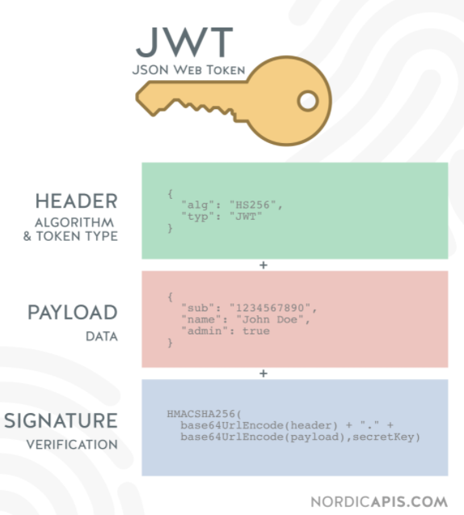

# 1.前端处理10万条数据

```
①定时器
拿到10万条数据后，分组确定每一组的数量，递归调用requestAnimationFrame,与浏览器的帧率配合渲染数据，使动画自然流畅。
优点:渲染后可在前端同时操作这大批量数据。

②触底请求
监听滚动事件,当滚动条触底时,触发请求,渲染下一批数据
wheel:监听的是滚轮，不管是否真实滚动，都会触发
scroll:卷动，只有内部的元素真实滚动时才会触发，与overflow：scroll有关


③虚拟滚动
将渲染区域，分为上，中，下区域，中是用户可以看到的区域,上，下是缓冲区域。
建立一个根据每一项长度*数据量=总高度的一个空的box，撑起一个真实滚动条,监听容器的滚动事件,根据滚动的高度和每一项的高度确定应该加载的数据，
使用requestAnimationFrame优化动画

缺点:列表项包含异步加载的图片/展开行/树结构时,高度计算会变的困难
```

# 2.OAuth2 双token

```
双token与jwt无关

双token是出现在特定场景下的，在OAuth2体系中，token的签发者和验证者不是一个实体，
要求验证者(资源服务器)每次去签发者(授权服务器)上去校验token不太现实，所以利用jwt进行无状态验证，

access_token随处要用，增大了泄露的风险，所以有效期短，防止泄露,refresh_toke专用刷新，很少出现在网上，泄露风险小，
中间人窃取refresh_toke难度高，即使拿到access_token也很快失效，权限泄露风险可控。
```

# 3.特定间隔执行程序,输出固定格式时间

```typescript
`使用requestAnimationFrame。`
padStart格式化文字 '2'.padStart(2,'0')  => '02'

因为setTimeout 和 setInterval 都是在特定间隔后把回调函数放入栈中,如果栈被阻塞，执行会超出预期。
如果非要使用的话，需要每一次调用时,与之前的time做对比，进行时间校验，查看是否超时。
requestAnimationFrame 是与浏览器的渲染帧相结合，执行的更频繁,优先级更高[微任务]。
```

# 4.判断函数是否被标记位async

```typescript
async name(){}
({}).toString.call(async)

'[object AsyncFunction]'
```

# 5.数据类型检测

## typeof

```typescript
`typeof 操作符是按照数据在计算机底层存储的二进制结果来进行检测的`
对象类型在浏览器底层的存储的二进制都是000开头，所以基于typeof检测对象类型的结果都是"Object"，这就导致typeof无法细分对象和数组。


优点：
能检测出 `number`,`boolean`,`string`,`symbol`,`undefined`,`function`,`object`

缺点：
`null`,`Array`,`AsyncFunction`等类型 检测不出
基础数据类型，null返回object，其他都可以返回正确结果
引用的数据类型，除了function，其它都返回object[例如正则,数组]
function都返回function类型[例如 async类型的function]
```

## instanceof

```typescript
obj instanceof 构造函数

用于测试构造函数的prototype属性是否出现在`对象`的原型链中

优点：
可以检测出特定的引用类型的具体类型

缺点：
只能用于对象类型的检测，无法检测基本数据类型。
无法检测undefined和null
`存在很多问题,因为object也出现在arr的原型链上`
原型链可自定义

[] instanceof Object  true


function myInstncaeof(obj，fn){
    let prototype = fn.prototype;
    let proto = obj.__proto;
    while(__proto__){
		if(__proto__ == prototype){
            return true;
        };
        proto = proto.__proto__
	}
    return false;
}
```

## constructor

```typescript
(1).constructor === Number      true
('1').constructor === String    true
([]).constructor === Array      true
(()=>{}).constructor === Function
(async function  name(){}).constructor  === AsyncFunction
优点：
基本上基本数据类型和引用数据类型都可以检测，但是`除了自定义的对象`和一些特殊的类型 `AsyncFunction`

缺点：
`AsyncFunction`不是一个普通变量,不可以直接使用。
undefined，null无法检测
constructor是通过获取数据的构造函数来确定数据的类型,自定义对象的constructor是不可靠的，可以自定义的

function Name(){};
let name1 = new Name();
name1.constructor === Name 
name1的构造函数是Name。不符合
```

## ({}).toString.call()

Object.prototype.toString.call() 

```typescript
({}).toString.call(async function  name(){}) ==> '[object AsyncFunction]'

优点：
大部分的数据类型都可以检测
缺点：
Object.prototype.toString函数是允许被修改的。
`*`自定义的类是不能准确判断的,可以采用[Symbol.toStringTag]给构造函数添加tag

function Name(){};
let name1 = new Name();
({}).toString.call(name1)                //[object Object]

//自定义[Symbol.toStringTag] 
Name.prototype[Symbol.toStringTag] = 'my'
({}).toString.call(name1)                //[object my]


class ValidatorClass {
  get [Symbol.toStringTag]() {
    return 'Validator';
  }
} 
({}).toString.call(new ValidatorClass())  //[object Validator]

```

类型检测：typeof检测基础类型，toString检测object，function。

# 6.js实现Ajax并发请求限制

```typescript
const tasks = [
    () =>
        new Promise((resolve, reject) => {
            setTimeout(() => resolve(0), 2000);
        }),
    () =>
        new Promise((resolve, reject) => {
            setTimeout(() => resolve(1), 1000);
        }),
    () =>
        new Promise((resolve, reject) => {
            setTimeout(() => resolve(2), 5000);
        }),
    () =>
        new Promise((resolve, reject) => {
            setTimeout(() => resolve(3), 1000);
        }),
];

class myTask {
    max;
    running = 0;
    results = [];
    index = 0;
    count = 0;
    constructor(max = Infinity, tasks = []) {
        this.max = max;
        this.tasks = tasks;
    }
    run() {
        return new Promise((resolve, reject) => {
            this.resolve = resolve;
            this.reject = reject;
            while (this.index < this.tasks.length && this.running < this.max) {
                this.next();
            }
        });
    }
    next() {
        if (this.count == this.tasks.length) {
            this.resolve(this.results);
        } else if (this.index < this.tasks.length && this.running < this.max) {
            this.running++;
            let index = this.index;
            this.index++;
            console.time(index);
            Promise.resolve(this.tasks[index]()).then((result) => {
                console.timeEnd(index);
                this.results[index] = result;
                this.running--;
                this.count++;
                this.next();
            });
        }
    }
}
console.time('start');
let task1 = new myTask(2, tasks);
task1.run().then((results) => {
    console.log(results);
    console.timeEnd('start');
});

分步骤：
1. 直接推进去最大运行数的promise
2. 当有promise运行完成后，判断是否已经全部运行完毕,未完毕就将下一个promise推入
```

# 7.iframe缺点

1. 页面缓存策略有问题
2. iframe内部弹窗，只会在iframe中
3. 页面样式调试麻烦
4. 阻塞页面加载
5. 浏览器后退按钮失效
6. 产生多个页面，不易管理

```typescript
`缓存策略问题`：
iframe不属于元素,不会将内容缓存，在iframe位置变更时，页面会刷新，内部状态会更改，而且iframe页面在浏览配置清除缓存时才会在页面刷新时请求新的资源，否则使用旧资源。
```

# 8.CommonJS,AMD,UMD,ESM

1. 全局变量污染
2. 变量重名
3. js间的依赖关系复杂，无法保证顺序

## CommonJS

1. 运行时加载，只在加载时运行一次
2. 同步加载
3. 可以在块级作用域或条件语句

```typescript
CommonJS是一种用于非浏览器环境的JavaScript模块化规范，最常见的场景是用于NodeJS。
```

## AMD

`require.js`

1. 异步加载模块
2. 依赖前置，模块加载前会先加载依赖,加载完成后执行回调
3. 运行时加载

```typescript
// 引入
require(["./amd.js"], function (m) { 
    console.log(m); 
});

// 导出
define(['dep1', 'dep2'], function (dep1, dep2) { 
    // Define the module value by returning a value. 
    return function () {}; 
});
```

## CMD

`sea.js`

1. 依赖后置，需要时才通过require加载依赖

```typescript
 // 引入 
seajs.use(["./cmd2.js"], function () { 
    ...
});

// 导出
define(function (require, exports, module) { 
    ...
    const num = require("./cmd3.js");
    ...
});
```

## UMD

UMD(Universal Module Definition)，通用模块定义，顾名思义是对以上几种标准的统一，使每个版本都能兼容运行。

1. 兼容浏览器和服务端两种场景
2. 兼容CMD,AMD,CJS

```typescript
(function (root, factory) { 
    if (typeof define === "function" && define.amd) { 
    // 支持 AMD 规范
        define(["jquery", "underscore"], factory);
    } else if (typeof define === 'function' && define.cmd){ 
    // 支持 CMD 规范
        define(function(require, exports, module) { 
            module.exports = factory() 
        })
    } else if (typeof exports === "object") { 
    // 支持 CommonJS
        module.exports = factory(require("jquery"), require("underscore")); 
    } else { 
    // 支持全局引用
        root.Requester = factory(root.$, root._); 
    } 
}(this, function ($, _) { 
    // this is where I defined my module implementation 
    var Requester = { // ... }; 
    return Requester; 
}))
```

## ESM

ESM(ES Module)，基于ES的模块标准，也是当前最常使用的模块化标准。

1. 支持tree-shaking
2. 支持异步加载
3. 编译时加载
4. 浏览器支持

```typescript
 // 引入
import {foo, bar} from './myLib'; 

// 导出
export default function() { 
    // your Function 
}; 
export const function1() {...}; 
export const function2() {...}
```

# loader和plugin

1. loader让webpack可以处理其他类型的文件，将文件添加到依赖图
2. plugin订阅webpack打包的生命周期，执行自定义任务

# 查询css属性的时候会触发重排么 ？

```typescript
浏览器是通过队列来批量更新布局的，浏览器会将触发回流重绘的操作放到一个队列中，当任务到达一定数量/一定时间后会执行队列任务。
`当要获取布局信息时，浏览器会为了返回准确值，强制清空队列触发回流重绘`
offset*，scroll*, client*, width, height, getComputedStyle(), getBoundingClientRect();

elementA.className = "a-style";
var heightA = elementA.offsetHeight; // layout is needed 
elementB.className = "b-style"; // invalidates the layout 
var heightB = elementB.offsetHeight; // layout is needed again
```

# CDN

`内容分发网络`

应用`CDN`后，`DNS`返回的不是IP地址，而是一个`CNAME(Canonical Name 别名记录)`,指向全局的负载均衡。

由于没有返回`IP`,本地`DNS`会向返回的`CNAME`发起请求，进入到`CDN`系统中。

CDN就是通过将站点内容发布至遍布全球的海量加速节点，使用户可就近获取所需内容

1. 物理距离远，多次网络转发，延时高不稳定
2. 所在运营商不同，需运营商之间转发绕行
3. 网络带宽处理能力有限，海量请求时，响应速度与可用性降低


1. 当用户点击网站页面上的内容URL，经过本地DNS系统解析，DNS 系统会最终将域名的解析权交给 [CNAME](https://link.zhihu.com/?target=https%3A//en.wikipedia.org/wiki/CNAME_record) 指向的 CDN 专用 DNS 服务器。
2. CDN 的 DNS 服务器将 CDN 的全局负载均衡设备 IP 地址返回用户。
3. 用户向 CDN 的全局负载均衡设备发起内容 URL 访问请求。
4. CDN 全局负载均衡设备根据用户 IP 地址，以及用户请求的内容URL，选择一台用户所属区域的区域负载均衡设备，告诉用户向这台设备发起请求。
5. 基于以下这些条件的综合分析之后，区域负载均衡设备会向全局负载均衡设备返回一台缓存服务器的IP地址：
6. 根据用户 IP 地址，判断哪一台服务器距用户最近；
7. 根据用户所请求的 URL 中携带的内容名称，判断哪一台服务器上有用户所需内容；
8. 查询各个服务器当前的负载情况，判断哪一台服务器尚有服务能力。
9. 全局负载均衡设备把服务器的 IP 地址返回给用户。
10. 用户向缓存服务器发起请求，缓存服务器响应用户请求，将用户所需内容传送到用户终端。如果这台缓存服务器上并没有用户想要的内容，而区域均衡设备依然将它分配给了用户，那么这台服务器就要向它的上一级缓存服务器请求内容，直至追溯到网站的源服务器将内容拉到本地。

```typescript
CDN本身就是一种DNS劫持，只不过是良性的，不同于黑客强制DNS把域名解析到自己的钓鱼IP上，CDN则是让DNS主动配合，把域名解析到临近的服务器上。
```

# 劫持

## 域名劫持

```typescript
DNS劫持，通常是指域名指向非正常IP(恶意IP)，该恶意IP通过反向代理，在返回网页正常内容时，可能插入恶意代码，监听网民访问，劫持敏感信息。
`1.`可通过PING一个域名，如果IP不是服务器真实地址，可能是被劫持了，如果使用了加速平台，得到的IP是平台IP
```

## 数据劫持

```typescript
运营商内部员工在公网中进行数据支持，插入。直接数据流经运营商宽带时在网页中插入内容。
`1.`可通过https加密，运营商无法插入恶意内容
```

# list转成树状结构

```typescript
var userList = [
    {
        name: 'user1',
        age: 18,
        province: '四川',
        city: '成都',
        district: '高新区',
    },

    {
        name: 'user2',
        age: 19,
        province: '四川',
        city: '成都',
        district: '天府新区',
    },

    {
        name: 'user3',
        age: 20,
        province: '四川',
        city: '南充',
        district: '顺庆区',
    },

    {
        name: 'user4',
        age: 22,
        province: '江苏',
        city: '南京',
        district: '鼓楼区',
    },

    {
        name: 'user5',
        age: 21,
        province: '江苏',
        city: '南京',
        district: '玄武区',
    },

    {
        name: 'user6',
        age: 21,
        province: '江苏',
        city: '镇江',
        district: '京口区',
    },
];
```

## 循环

```typescript
function list2tree(list, path) {
    const level = path.split('/');
    let result = [];
    list.forEach((element) => {
        let pre = result;
        level.forEach((l) => {
            let item = pre.find((item) => item[l] == element[l]);
            if (!item) {
                item = {
                    [l]: element[l],
                    children: [],
                };
                pre.push(item);
            }
            pre = item.children;
        });
    });
    // TODO
    console.log(result);
}

var userTree = list2tree(userList, 'province/city/district');

```

## 递归

```typescript
function list2tree(list, path) {
    const levels = path.split('/');
    let result = getChildren(0, undefined);
    console.log(result);
    return result;
    function getChildren(index, parentID) {
        if (index == levels.length) {
            return [];
        }
        let children = [];
        for (let item of list) {
            // 层层收集
            if (item[levels[index - 1]] !== parentID) {
                continue;
            }
            let origin = children.find(
                (i) => i[levels[index]] == item[levels[index]]
            );
            if (!origin) {
                origin = {
                    [levels[index]]: item[levels[index]],
                    children: getChildren(index + 1, item[levels[index]]),
                };
                children.push(origin);
            }
        }
        return children;
    }
}
```


# 大文件上传

1. 获取上传的文件
2. 文件切片后存入数组 chunkList
3. 生成文件的hash【文件大可通过 Web Workers生成】
4. 生成请求列表
5. 并发请求【文件过大时控制请求数👆6】
6. 所有请求完成后，发送合并请求

## 文件秒传

```typescript
将文件的`hash`发送给后端，后端验证该文件是否存在，如果存在，妙传成功。
```

## 断点传送

### 暂停上传

上传完成后，将切片从队列删除，队列只保存未上传的切片

```typescript
`axios` ,`fetch`中可通过 AbortController 暂停上传
```

### 恢复上传

再次上传前，向后台发送请求，接口返回已上传的切片列表，通过hash将后台已存在的切片过滤，只上传未存在的切片。

# 性能指标

```typescript
`谷歌RAIL`:RAIL 代表 Web 应用程序生命周期的四个不同方面：响应(R)、动画(A)、空闲时间(I)和加载(L)。
FP(First Paint):表示渲染出第一个像素点，一般在HTML解析完或者解析一部分时触发。
FCP(First Contentful Paint):表示渲染出第一个内容。
FMP(First Meaningful Paint):渲染出有意义内容的时间。
LCP（largest contentful Paint）:最大内容渲染时间

DCL(DOMContentLoaded):dom解析完毕
load(Onload Event):页面中依赖的所有资源加载完的事件
白屏时间:
首屏加载时间
```

# 白屏

1. 现在的vue，react，angular框架都是单页应用，打包成js渲染页面，文件大，加载时间长，加载后还要执行解析执行渲染，会导致页面一段时间白屏。


# SSR，预渲染，骨架屏

预渲染和服务端渲染原理相似，都是在请求资源返回到浏览器之前先把页面完整渲染出来。

进行`SEO优化`

## 预渲染


```typescript
当项目代码构建时（build time）简单地`生成一些针对特定路由的静态HTML文件`，使浏览器在请求服务器之前就能渲染一些文字或内容，以便于提高SEO优化和首页白屏的缺陷（至少用户可以看到东西不那么焦虑）

`过程：`构建打包后，插件在本地启动express静态服务，serve打包好的静态资源。然后再启动一个无界面浏览器,浏览器从服务器请求网页，网页运行时会请求首屏接口，用拿到的数据渲染出包含内容的首屏后，`无界面浏览器在dist包输出特定路由的html文`件,用户在请求时直接返回html，可快速渲染页面，避免白屏。
`优点：` 1.包含ssr优点，但请求时间优化没ssr好
        2.操作简单，不需要服务器
`缺点：`
        1.不适合频繁变动的界面，设置路由越多，构建时间越长
        2.用户容易误操作，预渲染时js还没加载，展示出来的内容没有js的交互逻辑，例如按钮没反应
        3.页面内容依赖动态数据时，编译时无法加载动态数据，这部分编译不出来
```

## 服务端渲染SSR

```typescript
服务端收到请求后，把组件渲染成HTML字符串，返回给客户端，之后客户端渲染


`优点：`更好的seo，更快的内容请求
`缺点：`
1.涉及到构建，调试，部署更多的设置和要求
2.后端部署node
```

```typescript
1.`预渲染的使用场景更多是静态页面的形式`
2.`服务端渲染适合大型的，页面数据较多，较复杂，与服务端有交互的功能性网站`
```

## 骨架屏

实现原理和预加载类似，根据路由生成骨架屏。

利用了[Puppeteer](https://link.segmentfault.com/?enc=d29edzMC5m2sYN4aBK03iw%3D%3D.liIhTUnYetbmkHBFbf%2FkMhYHcI5CZpnwR6y2nEsH7GTDKjQhvihRafEJAweeb1Tnkuv5kVB3SajfjgLxsgPfbZDeZ%2BIwJcEt35V8alG4JXM%3D)爬取页面的功能，利用算法将生成的内容进行替换，生成骨架页面，`page-skeleton-webpack-plugin`是一个用来生成骨架屏的webpack插件。


```typescript
在访问对应路由时，会先看到对应的骨架屏，在js加载后，数据显示。
```

# 单点登录

`SSO`: 在多个应用系统中，用户只需要登录一次就可以访问所有相互信任的应用系统.

SSO一般需要一个独立的认证中心。


当`Application1`、`Application2`、`Application3`需要登录时，将跳到`SSO`系统，`SSO`系统完成登录，其他的应用系统也就随之登录了。

淘宝，天猫都属于阿里旗下，当用户登录淘宝后，再打开天猫，系统帮用户登录天猫，这种现象就属于单点登录。

## 同域名下的单点登录

`tieba.baidu.com`,`fanyi.baidu.com`,`sso.baidu.com`

```typescript
在sso.baidu.com 登陆后把Cookie的域设置为顶域，这样所有的子域系统都可以访问到顶域的Cookie。
```

## 不同域下的单点登录

`app1`,`app2`,`sso`

1. 访问app1，app1没登陆，跳转到sso
2. sso登录后，状态写入sso的session，浏览器中写入sso域下Cookie
3. sso登陆后生成一个ST(Service Ticket)，跳转到app1，携带ST参数
4. app1拿到ST后，后台向SSO验证，通过后app1将登陆状态写入session并设置app1域下的Cookie

一个系统登陆完成

1. 用户访问app2，未登录，跳转sso
2. sso已经登录，不需要重新登录
3. sso生成ST，跳转到app2，并携带ST参数
4. app2拿到ST后去sso验证
5. 验证成功后，app2将登陆状态写入session，并在app2域写下Cookie

# Cookie，session，token,jwt

## cookie

`出现原因`：http是无状态的，用于解决如何记录客户端用户信息

cookie是服务器创建后返回给浏览器的。浏览器只是进行了保存，在下次访问时携带。


`Name/Value`: 存储键值对

`Domain`: 可以访问cookie的域名，如果设置为`.google.com`，所有以`google.com`结尾的域名都可以访问该cookie

`secure`:  该cookie是否仅被使用安全协议传输。HTTPS,SSL等，在网络传输前将数据加密，默认false

`Path`: cookie的作用域范围，当前访问URL的路径是path或其子路径时cookie才可以被访问到。

`Expires/Max-Age`:  cookie的过期时间

`Size`:  cookie的大小

`HttpOnly`:  默认为false，为true时cookie只能通过服务端修改,js修改不了

```typescript
`缺点`：
1.cookie存储有限制
2.每次携带数据量过大
3.cookie被禁用
```

## session

session机制将用户的所有活动信息，上下文信息，登录信息等都存储在服务器，生成一个唯一标识发送给客户端，后续的交互只需要传递ID，`sessionID`，浏览器请求时携带`sessionID`，服务器通过`sessionID`查找用户信息。

```typescript
`缺点`：
1.服务器压力大
2.服务器有负载均衡配置时，到第二个服务器时无sessionID
```

## token

用户登录后，服务端通过加密算法和密钥对数据进行加密生成签名，将签名和数据一起作为`token`发送给浏览器，服务器不保存token，当浏览器再次请求时，携带`token`，服务端再对数据使用同样的密钥加密，和`token`比较.如果相同，证明已经登陆过了，直接获取 userID

## jwt

jwt本质是一个字符串书写规范，用来在用户和服务器之间传递消息。


分为3部分：

1. 头【加密算法】
2. 载荷【消息相关信息】
3. 签名【对头和载荷进行签名】



# 虚拟DOM和增量DOM

## 虚拟DOM [React,Vue]

1. 用户UI发生变化，将整个UI渲染到虚拟DOM中
2. 计算之前虚拟DOM和当前虚拟DOM之间的差异(diff)
3. 根据计算映射到真实DOM


### 优点

1. 高效的diff算法只更新必要的部分，减少操作真实DOM，提高性能
2. 提高开发效率，只需要关心业务逻辑，不需要过多关注DOM操作
3. 跨平台支持，虚拟DOM不依赖于环境

## 缺点

在区分(diff)过程减少了真实DOM的工作量，但是需要将当前的虚拟DOM与之前的状态进行比较。

1. 微小的变化都会让整体比较[组件一个属性变化，会对比整个组件每一个元素]
2. 虚拟DOM占用内存

## 增量DOM [Angular]

`优化了内存的使用`

1. 使用真实的DOM来定位代码更改，内存不会有真实DOM的数据映射来表示计算差异
2. 将每一个组件编译成一组指令，指令对DOM进行创建/更改
3. 构建阶段将静态节点和动态节点分离,Angular组件打包成两个函数，创建函数和更新函数。减少计算【Angular ivy】


### 优点

1. 降低了计算开销，优化了应用程序内存使用
2. 适用于移动设备[内存要求小]
3. 易于其他框架结合使用

### 缺点

1. 增量DOM的差异计算比虚拟DOM耗费时间